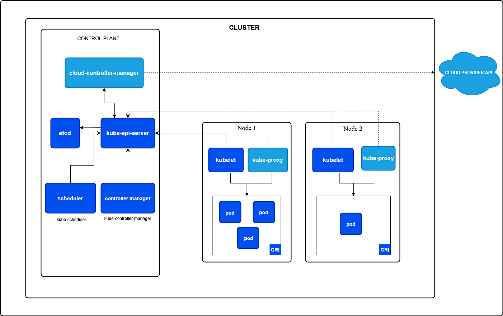
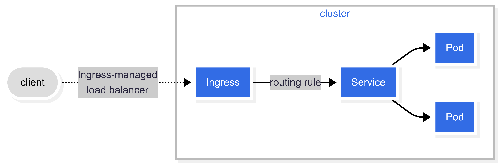

# Introduction to Kubernetes

## Introduction/Summary of Container Technologies (Docker), Basics

### Containers

Containers are self-contained, lightweight packages that hold everything an application needs to run: the code, a runtime, system tools, libraries, and settings.

They isolate an application and its dependencies from both the host machine and other containers.

**The Problem Containers Solve** - "It works on my machine!" - Containers ensure that an application runs the same way regardless of where it's deployed, solving issues related to environment differences. (at least in an ideal world)

### Containerization vs Virtualization

Containers are often compared to Virtual Machines (VMs), but they are fundamentally different.
- Virtual Machines virtualize the entire hardware stack, including the operating system. Each VM runs a full copy of an operating system, making them large and resource-intensive.
- Containers virtualize the operating system at the kernel level. They share the host machine's OS kernel, making them much smaller, more efficient, and faster to start.

### Key concepts of containerization

- **Image:** A ready to run SW package, which includes the application and its dependencies, but is not running. It serves as a template or blueprint for creating containers.
- **Container:** A running instance of an image, which includes the application and its dependencies. It's a running process with its own file system, network, and isolated resources.
  - it should be immutable and stateless (as much as possible, best practice)
- **Container Engine:** The software that manages the container lifecycle, including building, running, and distributing images and containers.
- **Docker:** The most widely used containerization platform, which provides an easy-to-use toolkit for building, sharing, and running containers.

### Quick docker demo

In a short demo, we will demonstrate the preparation of a simple Docker image and running a container from it. Container will run a simple Flask web server.

Have a look at files in [./examples/docker_intro/](./examples/docker_intro/), the folder contains:
- `app.py` - python code for a simple Flask web server
- `requirements.txt` - python dependencies
- `Dockerfile` - instructions for building the Docker image
- `docker-compose.yaml` - instructions for running the container with docker-compose

The Python code is simple, and the same demo could be done in any language — Python is chosen here for readability

If we were running the code directly on our machine, we would first install dependencies from `requirements.txt` and then run `app.py` to start the application. Our web server would be listening on port `5000`.

If we want to run the app with docker instead, we need to build a Docker image first. The `Dockerfile` contains instructions for building the image. Let's have a look at it: [./examples/docker_intro/Dockerfile](./examples/docker_intro/Dockerfile)

```Dockerfile
# Use a slim Python 3.12.3 image as the base
FROM python:3.12.3-slim

# Set the working directory inside the container
WORKDIR /app

# Copy the requirements file and install dependencies
COPY requirements.txt .
RUN pip install -r requirements.txt

# Copy the application code
COPY app.py .

# Tell Docker that the container listens on port 5000
EXPOSE 5000

# Run the application when the container starts
CMD ["python", "app.py"]
```

To build the image, run the following command:

```bash
docker build -t flask-hello-world ./examples/docker_intro/
```

You should see the output of the command similar to this:

```text
[+] Building 21.3s (10/10) FINISHED                                                                                                                                          docker:default
 => [internal] load build definition from Dockerfile                                                                                                                                   0.1s
 => => transferring dockerfile: 470B                                                                                                                                                   0.0s
 => [internal] load metadata for docker.io/library/python:3.12.3-slim                                                                                                                  0.8s
 => [internal] load .dockerignore                                                                                                                                                      0.0s
 => => transferring context: 2B                                                                                                                                                        0.0s
 => [1/5] FROM docker.io/library/python:3.12.3-slim@sha256:afc139a0a640942491ec481ad8dda10f2c5b753f5c969393b12480155fe15a63                                                            9.1s
 => => resolve docker.io/library/python:3.12.3-slim@sha256:afc139a0a640942491ec481ad8dda10f2c5b753f5c969393b12480155fe15a63                                                            0.0s
 => => sha256:afc139a0a640942491ec481ad8dda10f2c5b753f5c969393b12480155fe15a63 1.65kB / 1.65kB                                                                                         0.0s
 => => sha256:fd3817f3a855f6c2ada16ac9468e5ee93e361005bd226fd5a5ee1a504e038c84 1.37kB / 1.37kB                                                                                         0.0s
 => => sha256:cf001c2f8af7214144935ae5b37c9e626ccf789117c10c1f691766d4658f1b1e 6.69kB / 6.69kB                                                                                         0.0s
 => => sha256:09f376ebb190216b0459f470e71bec7b5dfa611d66bf008492b40dcc5f1d8eae 29.15MB / 29.15MB                                                                                       1.0s
 => => sha256:276709cbedc1f168290ee408fca2af2aacfeb4f922ddca125e9e8047f9841479 3.51MB / 3.51MB                                                                                         0.3s
 => => sha256:2e133733af76c2a11aee79b7cfc733cc8065bc538d74b80ad65846d336a0904e 12.00MB / 12.00MB                                                                                       0.8s
 => => sha256:ded8879d9a790c3944bc22c2bed1606a9a2d4d293f2a32399fb183d577c0190a 243B / 243B                                                                                             0.6s
 => => sha256:3cf9507408dcb24084c3a20ccd068986cc37d1b13629d357f402581af5177013 3.05MB / 3.05MB                                                                                         1.0s
 => => extracting sha256:09f376ebb190216b0459f470e71bec7b5dfa611d66bf008492b40dcc5f1d8eae                                                                                              4.5s
 => => extracting sha256:276709cbedc1f168290ee408fca2af2aacfeb4f922ddca125e9e8047f9841479                                                                                              0.4s
 => => extracting sha256:2e133733af76c2a11aee79b7cfc733cc8065bc538d74b80ad65846d336a0904e                                                                                              1.5s
 => => extracting sha256:ded8879d9a790c3944bc22c2bed1606a9a2d4d293f2a32399fb183d577c0190a                                                                                              0.0s
 => => extracting sha256:3cf9507408dcb24084c3a20ccd068986cc37d1b13629d357f402581af5177013                                                                                              0.8s
 => [internal] load build context                                                                                                                                                      0.1s
 => => transferring context: 366B                                                                                                                                                      0.0s
 => [2/5] WORKDIR /app                                                                                                                                                                 1.0s
 => [3/5] COPY requirements.txt .                                                                                                                                                      0.1s
 => [4/5] RUN pip install -r requirements.txt                                                                                                                                          9.4s
 => [5/5] COPY app.py .                                                                                                                                                                0.1s
 => exporting to image                                                                                                                                                                 0.6s
 => => exporting layers                                                                                                                                                                0.6s
 => => writing image sha256:7105557f70403c522ce6d9fc7ff60cfc85d51dedd6d95b943b1ab1ef16252a36                                                                                           0.0s
 => => naming to docker.io/library/flask-hello-world                                                                                                                                   0.0s
```

This command will build the Docker image in the context of directory `./examples/docker_intro/` and tag it as `flask-hello-world`.

We can list the images we have on our machine with:

```bash
docker images
```

```txt
REPOSITORY                    TAG       IMAGE ID       CREATED              SIZE
flask-hello-world             latest    7105557f7040   About a minute ago   145MB
```

We can now run this image with command:

```bash
docker run -d -p 8000:5000 --name flask-web-server flask-hello-world
```

This command uses several options and parameters:
- `-d` - detached mode, run the container in the background so we can still use the current terminal
- `-p 8000:5000` - map port 5000 in the container to port 8000 on the host machine, so we can access the web server from outside the container
- `--name flask-web-server` - give the container a name, so we can easily refer to it later
- `flask-hello-world` - the name of the image to run

As a response, we get the container ID:

```text
031fb9c7b77d6f1e5c3f4e8b6c8e2f4c1b6e5f4e8b6c8e2f4c1b6e5f4e8b6c8e
```

To see which containers are running, we can use the following command:

```bash
docker ps
```
```text
CONTAINER ID   IMAGE                                 COMMAND                  CREATED         STATUS         PORTS                                                                                                                                  NAMES
031fb9c7b77d   flask-hello-world                     "python app.py"          7 seconds ago   Up 6 seconds   0.0.0.0:8000->5000/tcp, [::]:8000->5000/tcp                                                                                            flask-web-server
```

We can now access the web server in our web browser at `http://localhost:8000` or with `curl`:

```bash
curl http://localhost:8000
```
```text
Hello, Docker!
```

To stop the container, we can use the following command:

```bash
docker stop flask-web-server
```

Or remove it completely with:

```bash
docker rm -f flask-web-server
```

This is a very basic introduction to Docker and containers. There are many more features and options available, but this should give you a good starting point.

Before moving forward to the Kubernetes topic, we will briefly touch one more concept in Docker - Docker Compose.

Docker compose is a tool for defining and running multi-container Docker applications. With Compose, you use a YAML file to configure your application's services, networks, and volumes. Then, with a single command, you create and start all the services from your configuration. This introduces the concept of declarative configuration (also a fundamental concept of Kubernetes), where you don't specify exact steps to achieve a goal, but rather describe the desired state, and the tool figures out how to achieve it.

Let's setup our flask application with docker compose file to demonstrate the tool. First of all we need to create another file: `docker-compose.yaml` (in same directory as `Dockerfile` and python code). 

See: [docker-compose.yaml](./examples/docker_intro/docker-compose.yaml)

```yaml
services:
  web:
    build: . # Builds the image from the Dockerfile in the current directory
    ports:
      - "8000:5000" # Maps host port 8000 to container port 5000
```

This docker compose is very simple, it defines a single service called `web`, which builds the image from the `Dockerfile` in the current directory and maps port 8000 on the host to port 5000 in the container.
```bash
docker compose -f examples/docker_intro/docker-compose.yaml up -d
```

In the command above we use `-f` to point to `docker-compose.yaml` file, `up` to create and start the containers, and `-d` to run them in detached mode.

The end of output should look like this:

```text
...
  [+] Running 3/3
   ✔ docker_intro-web              Built                                                                                                                                                                                                                 0.0s
   ✔ Network docker_intro_default  Created                                                                                                                                                                                                               0.2s
   ✔ Container docker_intro-web-1  Started 
```

Showing us that there was a network created for our application and the container is started.

Again we can check the running containers with `docker ps` and access the web server at `http://localhost:8000`.

Evan though the `docker-compose.yaml` file is very simple, it demonstrates the power of declarative configuration. We can easily add more services, networks, and volumes to our application by simply updating the YAML file and running `docker compose up -d` again.

Declarative configuration brings one other benefit - version control. We can store the `docker-compose.yaml` file in a version control system (e.g., git) and track changes to our application's configuration over time.

If you are interested more in the capabilities of `docker` please refer to the [official documentation](https://docs.docker.com/).


## Why Kubernetes? The Need for Orchestration

If a single container is like a single brick, Kubernetes is the powerful machine that builds and manages the entire wall, ensuring it's stable, available, and scalable. 

At its core, Kubernetes is a container orchestration platform. It automates the deployment, scaling, and management of containerized applications.

### The Problem with Standalone Containers

Imagine you've successfully containerized your application. That's a great first step, but what happens next?

- **Scaling:** If your application gets a sudden surge in traffic, how do you quickly spin up 10 more copies of your container to handle the load?
- **High Availability:** What if a server running your container crashes? Who restarts it on a healthy server? What if the container itself crashes?
- **Updates:** How do you roll out a new version of your application without any downtime for your users? You need a controlled way to replace old containers with new ones.
- **Service Discovery:** How do the different containers in your application (e.g., a web service and a database) find and communicate with each other?

Manually handling these tasks for dozens or hundreds of containers is virtually impossible. This is the problem that container orchestration solves.

It does not mean that you could not handle these tasks with Docker alone, as it is capable of doing some of these tasks, but it might require a lot of your manual intervention and scripting.

### What is Kubernetes and What Problems Does it Solve?

Kubernetes is an open-source platform designed to address these challenges. It provides a robust framework to automatically manage your containerized workloads.

- **Automated Scaling:** You can tell Kubernetes to maintain a certain number of replicas of your application. When demand increases, it can automatically scale up the number of containers.
- **Self-Healing:** If a container or even an entire server fails, Kubernetes will automatically detect the failure and reschedule the affected containers onto a healthy node. It's designed for high availability by constantly monitoring the state of your application.
- **Automated Rollouts and Rollbacks:** When you deploy a new version, Kubernetes can manage a controlled rollout, replacing old containers with new ones one at a time. If the new version has issues, it can automatically roll back to the previous version.
- **Service Discovery and Load Balancing:** Kubernetes assigns each container a unique IP address and DNS name. It also has a built-in load balancer that automatically distributes network traffic to all the running containers of your application.
- **Configuration and Secret Management:** It provides a way to centrally manage configuration data and sensitive information (like passwords and API keys) and inject them into your containers securely.

### What Kubernetes Is Not

Just as important as understanding what Kubernetes does is understanding what it doesn't do.

- **It's Not a Platform-as-a-Service (PaaS):** Unlike a PaaS (like Heroku or Google App Engine), Kubernetes doesn't offer a complete, end-to-end solution out of the box. You still have to manage the underlying infrastructure. It's a layer of abstraction, but it requires more configuration and expertise.
- **It's Not a Build Tool:** It doesn't build your application's source code or create container images. That's still a job for tools like Docker.
- **It's Not a Complete Monitoring or Logging Solution:** While it provides basic monitoring and logging hooks, you typically integrate it with third-party tools to get a full-featured solution.
- **It Does Not Solve All Your Problems:** It's a powerful tool, but it also introduces its own complexity. It requires a significant learning curve and a dedicated team to manage it effectively.

In summary, Kubernetes is the control plane for your containers. It shifts your focus from managing individual containers to defining the desired state of your application, and then Kubernetes works to make that state a reality. It's why major companies and cloud providers use it to run massive, resilient, and scalable applications.

But it is important to remember that Kubernetes is a tool, you should always evaluate if it is the right tool for your specific use case, as it might be an overkill for smaller applications or teams.

## Kubernetes architecture: master and node components

### Control plane and Worker nodes

- **Control plane**: manages the Kubernetes cluster, making global decisions about the cluster (e.g., scheduling), detecting and responding to cluster events.
- **Worker nodes**: run the applications and workloads, managed by the control plane.
- In a single node cluster, the node acts as both control-plane and worker



### Control plane components:

- `kube-apiserver`
  - exposes the Kubernetes API
  - central point of communication for all components
- `etcd`
  - distributed key-value store for all cluster data
- `kube-scheduler`
  - watches for newly created pods and assigns them to nodes
- `kube-controller-manager`
  - run controller processes that handle routine tasks in the cluster

### Node components:

- `kubelet`
  - ensuring that containers are running in a pod according to PodSpec
- `kube-proxy`
  - maintains network rules on nodes, allowing communication to pods
  - implements part of the Kubernetes Service concept
- Container runtime (e.g., Docker, containerd)
  - responsible for managing the execution and lifecycle of containers

### How it works together

- Users interact with the cluster via `kubectl` or other clients, sending requests to the API server.
- The API server processes these requests and updates the desired cluster state in `etcd`.
- `etcd` is the cluster database and source of truth of the cluster state.
  - all the changes to `etcd` goes through the API server
- `kube-scheduler` watches the API server (which reflects the cluster state stored in etcd) for new Pods that need to be scheduled and assigns them to nodes.
  - it does not place them directly to the node, but updates the pod specification in `etcd` (via the API server) with the name of the node
- `kube-controller-manager` runs various controllers that monitor the state of the cluster (in `etcd` via the API server) and make adjustments to ensure the desired state is maintained.
  - `reconciliation loop` - controllers continuously compare the desired state with the current state and make changes as needed
- `kubelet` on each node watches the API server for pods assigned to its node and ensures that the containers are running as specified in the pod specification.
  - it interacts with the container runtime to start, stop, and manage containers
  - it reports the status of the pods back to the API server

## Installation of Kubernetes (e.g. with Minikube or kubeadm)

To work with Kubernetes on your local machine, you'll need more than a single command. The setup involves two main parts: first you need a local Kubernetes cluster (`Minikube`), and second, you need the tools to interact with it (`kubectl`).

This part of the workshop will show you how to install Minikube, which creates a Kubernetes cluster on your machine. You'll also install kubectl, the command-line tool you'll use to manage all your applications and resources on the cluster.

### Install kubectl

Before installing Kubernetes, it is good to have `kubectl` installed. `kubectl` is the command-line tool for interacting with Kubernetes clusters. So we will use it no matter what Kubernetes installation method we choose.

```bash
curl -LO "https://dl.k8s.io/release/$(curl -L -s https://dl.k8s.io/release/stable.txt)/bin/linux/amd64/kubectl"
```

```bash
sudo install -o root -g root -m 0755 kubectl /usr/local/bin/kubectl
```

```bash
kubectl version --client
```

#### `k` alias for `kubectl`

As the whole workshop will be using `kubectl` command a lot, it is convenient to create an alias for it. You can add the following line to your `~/.bashrc` or `~/.zshrc` file:

```bash
nano ~/.bashrc
```

Insert the following line at the end of the file:
```text
alias k='kubectl'
```
If using nano, save and close the file with `CTRL+X`, then `Y`, then `ENTER`.

Run the following command to apply the changes in your current terminal session:
```bash
source ~/.bashrc
```

Try the new alias:
```bash
k version --client
```

This should make your life easier and your hands less tired :-)

### Install minikube

Minikube is a tool that makes it easy to run Kubernetes locally. It creates a VM or runs a container on your local machine and deploys a Kubernetes cluster inside it. This is a great way to learn and experiment with Kubernetes without needing a full setup.

Before the installation of Minikube, we need to have at least one of the drivers installed https://minikube.sigs.k8s.io/docs/drivers/. One of the preferred solutions is to use Docker as a driver. If you don't have it yet, please consult the Docker installation guide for your OS: https://docs.docker.com/engine/install/

If you have docker installed, make sure that your user is added to the `docker` group, so you can run Docker commands without `sudo`. If you are not sure, you can run the following command:

```bash
sudo usermod -aG docker $USER && newgrp docker
```

Now let's install Minikube. The following commands will download the latest version of Minikube and install it on your system:

```bash
curl -LO https://github.com/kubernetes/minikube/releases/latest/download/minikube-linux-amd64
sudo install minikube-linux-amd64 /usr/local/bin/minikube && rm minikube-linux-amd64
```

Once installed, start the minikube with:

```bash 
minikube start
```

If everything goes well, you should see output similar to this:
```text
😄  minikube v1.36.0 on Ubuntu 24.04 (amd64)
✨  Automatically selected the docker driver. Other choices: none, ssh
📌  Using Docker driver with root privileges
👍  Starting "minikube" primary control-plane node in "minikube" cluster
🚜  Pulling base image v0.0.47 ...
💾  Downloading Kubernetes v1.33.1 preload ...
    > gcr.io/k8s-minikube/kicbase...:  502.26 MiB / 502.26 MiB  100.00% 68.97 M
    > preloaded-images-k8s-v18-v1...:  347.04 MiB / 347.04 MiB  100.00% 38.71 M
🔥  Creating docker container (CPUs=2, Memory=2200MB) ...
🐳  Preparing Kubernetes v1.33.1 on Docker 28.1.1 ...
    ▪ Generating certificates and keys ...
    ▪ Booting up control plane ...
    ▪ Configuring RBAC rules ...
🔗  Configuring bridge CNI (Container Networking Interface) ...
🔎  Verifying Kubernetes components...
    ▪ Using image gcr.io/k8s-minikube/storage-provisioner:v5
🌟  Enabled addons: storage-provisioner, default-storageclass
💡  kubectl not found. If you need it, try: 'minikube kubectl -- get pods -A'
🏄  Done! kubectl is now configured to use "minikube" cluster and "default" namespace by default
```

To test that everything is working correctly, you can run:

```bash
minikube kubectl -- get po -A
```
or if you have already installed `kubectl` you can run:

```bash
kubectl get po -A
```
This should show you the pods running in the `kube-system` namespace, which are the components of the Kubernetes cluster.

To clean everything up, you can stop and delete the Minikube cluster with:

```bash
minikube delete --all
```

You can manage the minikube cluster further, but for that, please refer to the [Minikube documentation](https://minikube.sigs.k8s.io/docs) as it is out of the scope of this workshop.

We will use Minikube for the rest of the workshop, but you can also use other methods to install Kubernetes, such as `kubeadm`, `k3s`, or managed Kubernetes services like AWS EKS, GKE, or Azure AKS. The concepts and commands will be similar, but the installation process may vary.

If you continue with minikube, launch a new cluster with the following command:

```bash
minikube start --nodes=3 --cni=cilium
```

Additionally, run this command, we will explain it later:
```bash
kubectl taint nodes minikube node-role.kubernetes.io/control-plane:NoSchedule
```

This starts minikube with two nodes so we can later demonstrate even some advanced features like multi-node deployments, etc.

We also set up `cilium` as a requested CNI plugin, which will be explained later in the workshop.

### Install Helm

Helm is a package manager for Kubernetes that helps you manage Kubernetes applications. It allows you to define, install, and upgrade complex Kubernetes applications using Helm charts.

See the instruction in official documentation: https://helm.sh/docs/intro/install/

```bash
curl -fsSL -o get_helm.sh https://raw.githubusercontent.com/helm/helm/main/scripts/get-helm-3
chmod 700 get_helm.sh
./get_helm.sh
```

We will use helm later in the course.

## Get started with Kubernetes: pods, deployments, services

### Pod
Core Concept:

- A Pod is the smallest deployable unit in Kubernetes.
- It contains one or more containers (usually one primary, others are "sidecars").

Pods are ephemeral and disposable: they get new IPs if they restart or are re-scheduled. This is a problem Services will solve.

Shared resources: Containers in a Pod share network namespace and volumes.

Usually, Pods are not created directly, but via Deployments.

Pod is meant to run a single instance of an application. In the case of scaling, multiple Pods are created. (Replication)

```yaml
apiVersion: v1
kind: Pod
metadata:
  name: nginx-pod
spec:
  containers:
    - name: nginx
      image: nginx
```

### ReplicaSet

A ReplicaSet ensures that a specified number of pod replicas are running at any given time.

A ReplicaSet is a higher-level abstraction that manages Pods, ensuring that the desired number of replicas are running.

If a Pod fails, the ReplicaSet will automatically create a new one to maintain the desired count (this is its self-healing capability).

While a ReplicaSet handles replication and self-healing, it does not provide advanced deployment features like rolling updates or rollbacks. That's why Deployments are built on top of ReplicaSets.

### Deployment
A Deployment manages a set of Pods to run an application workload, usually one that doesn't maintain state.

A Deployment is a higher-level abstraction that manages Pods and ReplicaSets. Hierarchy: `Deployment > ReplicaSet > Pods`

Describe the desired state (e.g., number of replicas, container images, etc.) and the Deployment controller will ensure that the current state matches the desired state.

```yaml
apiVersion: apps/v1
kind: Deployment
metadata:
  name: nginx-deployment
  labels:
    app: nginx-web
spec:  # ~ ReplicaSet spec
  replicas: 3
  selector:
    matchLabels:
      app: nginx-web
  template:  # PodTemplateSpec
    metadata:
      labels:
        app: nginx-web
    spec:  # Pod spec
      containers:
      - name: nginx
        image: nginx
        ports:
        - containerPort: 80
```

### Service

Exposes an application behind a single outward-facing endpoint, even when the workload is split across multiple backends.

A Service provides a stable IP address and DNS name for a set of Pods, allowing them to be accessed consistently. A Service uses labels and selectors to select which Pods it will route traffic to.

A Service can load balance traffic to multiple Pods, ensuring that the application is highly available and scalable.

If you use a Deployment to run your app, that Deployment can create and destroy Pods dynamically. Because of that, you don't know the IP addresses of the Pods in advance. A Service provides a stable endpoint to access those Pods.

Imagine a situation where you have two sets of pods representing backend and frontend of your application. As pods are ephemeral, you need a way to access the backend pods from the frontend pods without knowing and managing their IP addresses. For that, you can use a Service. which will serve as a single point of access to the backend pods.

Service Types (How you expose your application):
- ClusterIP: The default. Exposes the Service on an internal IP address. Only accessible from within the cluster.
  - headless service if `.spec.clusterIP: "None"` 
- NodePort: Exposes the Service on a static port on each Node's IP. Accessible from outside the cluster.
- LoadBalancer: Exposes the Service externally using a cloud provider's load balancer.
- ExternalName: Maps the Service to a DNS name, allowing you to access an external service by name.

```yaml
apiVersion: v1
kind: Service
metadata:
  name: nginx-clusterip-service # Name of your Service
  labels:
    app: nginx-web # Label for the Service itself
spec:
  selector:
    app: nginx-web # CRITICAL: This matches the 'app: nginx-web' label on your Pods
  ports:
    - protocol: TCP
      port: 80 # The port this Service itself will listen on
      targetPort: 80 # The port your container (Nginx) is listening on inside the Pod
  type: ClusterIP # Explicitly setting ClusterIP, though it's the default
```

#### Network model

- every pod gets its own cluster-wide IP address
- pod (cluster) network handles communication between pods
- the service API provides a stable long-lived IP address and hostname for a service implemented in the pod
  - k8s manages EndpointSlice objects to provide  
- Gateways and Ingresses provide external access to services
- Network policies can be used to control traffic between pods and between pods and external world

### Ingress

An API object that manages external access to the services in a cluster, typically HTTP.

An Ingress allows you to define rules for routing external HTTP/S traffic to specific services based on the request's host and path.

In the image, there is an example of Ingress that routes traffic to one Service.



Additionally, ingress can be configured to give Services externally-reachable URLs, provide SSL termination, load balancing, and other features.

```yaml
apiVersion: networking.k8s.io/v1
kind: Ingress
metadata:
  name: nginx-ingress
  annotations:
    nginx.ingress.kubernetes.io/rewrite-target: / # Rewrites the request path to '/'
spec:
  ingressClassName: nginx # Important: Specifies which Ingress Controller handles this Ingress
  rules:
  - http:
      paths:
      - path: / # Route traffic for the root path
        pathType: Prefix # Matches any path starting with '/'
        backend:
          service:
            name: nginx-clusterip-service # The name of your ClusterIP Service
            port:
              number: 80 # The port of that Service
    host: nginx.example.com # The hostname you'll use to access the service
```

#### Ingress Controller

In order to make Ingress work, you need to have an Ingress Controller running in your cluster. The Ingress Controller is responsible for fulfilling the Ingress rules and routing the traffic to the appropriate Services.

Ingress Controllers are not part of the Kubernetes core, but are implemented as separate components. Ingress Controllers can be implemented using various technologies, such as NGINX, Traefik, HAProxy, or cloud provider-specific solutions.

Kubernetes as a project supports and maintains AWS, GCE, and [nginx](https://github.com/kubernetes/ingress-nginx) ingress controllers.

[ingress-nginx](https://github.com/kubernetes/ingress-nginx) project is being [discontinued](https://github.com/kubernetes/ingress-nginx/issues/13002) in favor of [ingate](https://github.com/kubernetes-sigs/ingate) project.


#### Gateway API

It is designed to be a more flexible and extensible successor to the original `Ingress API`, providing advanced traffic management, better CRD extensibility, and improved support for modern networking use cases.
`Gateway API` is still evolving and is not yet as widely adopted as `Ingress`, but it is intended to become the standard for service networking in Kubernetes.

The `ingress-nginx` controller uses the original `Ingress API`, while `ingate` is designed to support the newer `Gateway API` in Kubernetes.

---

# Hands-on labs: Creating and managing pods and deployments


## Kubectl

Kubectl is the command-line tool for interacting with Kubernetes clusters.

First make sure that you have correct configuration to connect to your cluster (usually in `~/.kube/config`).

```bash
kubectl config get-contexts
```
```text
CURRENT   NAME            CLUSTER    AUTHINFO   NAMESPACE
*         minikube        minikube   minikube   default
```

```bash          
kubectl config use-context <context-name>
```

```bash
kubectl [command] [TYPE] [NAME] [flags]
```

```bash
kubectl get nodes
kubectl get namespaces
```

```txt
NAME           STATUS   ROLES           AGE     VERSION
minikube       Ready    control-plane   7m17s   v1.33.1
minikube-m02   Ready    <none>          6m16s   v1.33.1
minikube-m03   Ready    <none>          4m12s   v1.33.1
```

```txt
NAME              STATUS   AGE
cilium-secrets    Active   7m20s
default           Active   7m25s
kube-node-lease   Active   7m25s
kube-public       Active   7m25s
kube-system       Active   7m25s
```

```bash
kubectl explain node

kubectl explain namespace

kubectl explain pod
kubectl explain pod.spec
```

## General rules 

### Names

Kubernetes **names** must only contain lowercase alphanumeric characters and -.
For example, the names 123-abc and web are valid, but 123_abc and -web are not.

# Pods

Simple examples of a Pod: [nginx_pod.yaml](./examples/nginx_pod.yaml) and [redis_pod.yaml](./examples/redis_pod.yaml)

```bash
kubectl apply -f examples/nginx_pod.yaml 
kubectl apply -f examples/redis_pod.yaml
```

```bash
kubectl get pods
kubectl get po
```
```bash
kubectl get pods -o wide
```
```bash
kubectl get pod/nginx
```
```bash
kubectl get -f examples/nginx_pod.yaml 
```

## Accessing the pod

```bash
kubectl proxy
```
See: http://localhost:8001/api/v1/namespaces/default/pods/nginx/proxy/

```bash
kubectl port-forward pod/nginx 8000:80
```
See: http://127.0.0.1:8000

```bash
kubectl port-forward pod/redis 6379:6379
```

```bash
redis-cli ping
```

## `describe` - inspect a pod

```bash
kubectl describe pod nginx
kubectl describe pod redis
```

## `exec` - connect (ssh) to a pod

```bash
kubectl exec -it nginx -- /bin/bash
kubectl exec -it redis -- redis-cli  # ping
```

## `logs` - inspect logs of a pod

```bash
kubectl logs nginx
kubectl logs pod/nginx
kubectl logs nginx -f  # --follow=false
```

## `delete` - delete a pod

```bash
kubectl delete pod redis  # or -f examples/redis_pod.yaml
```

---

# ReplicaSet

Simple example of a ReplicaSet: [nginx_replicaset.yaml](./examples/nginx_replicaset.yaml)

```bash
kubectl apply -f examples/nginx_replicaset.yaml
```

```bash
kubectl get replicaset
kubectl get rs
```

Combined output of get for ReplicaSet and Pods:

```bash
kubectl get rs,po
```

```text
NAME    DESIRED   CURRENT   READY   AGE
nginx   3         3         3       1m

NAME              READY   STATUS             RESTARTS   AGE
pod/nginx         1/1     Running            0          17m
pod/nginx-nzvtj   1/1     Running            0          17m
pod/nginx-c6dc9   1/1     Running            0          17m
pod/nginx-gr7tb   1/1     Running            0          17m
```

## Replication in action

### Maintaining desired state

Try deleting one of the pods and see how ReplicaSet creates a new one to maintain the desired state.

```bash
kubectl delete pod <pod_name>  # in this example nginx-nzvtj
```

To observe the ReplicaSet in action, you can run:

```bash
kubectl get replicaset -w  # -w for watch, also works for pods and other resources
```

Then in other terminal, delete one of the pods and see the output.

```text
NAME    DESIRED   CURRENT   READY   AGE
nginx   3         3         3       13m  # original (desired) state
nginx   3         2         2       13m  # after deleting one pod
nginx   3         3         2       13m  # after ReplicaSet creates a new pod
nginx   3         3         3       13m  # back to desired state (pod comes to ready state
```

```text
NAME              READY   STATUS             RESTARTS   AGE
pod/nginx         1/1     Running            0          17m
pod/nginx-b7ztp   1/1     Running            0          3m27s  # replacement for deleted pod
pod/nginx-c6dc9   1/1     Running            0          17m
pod/nginx-gr7tb   1/1     Running            0          17m
```

### Updating desired state

Update the ReplicaSet to change the number of replicas:

```yaml
...
spec:
  replicas: 15  # from 3 to 15
...
```

```bash
kubectl apply -f examples/nginx_replicaset.yaml
```

Showing progress of the update:

```text
NAME    DESIRED   CURRENT   READY   AGE
nginx   3         3         3       32m  # initial state
nginx   15        3         3       32m  # after updating desired state
nginx   15        3         3       32m
nginx   15        15        3       32m  # after ReplicaSet creates new pods
nginx   15        15        4       32m  # first pod ready
nginx   15        15        5       32m
nginx   15        15        6       32m
nginx   15        15        7       32m
nginx   15        15        8       32m
nginx   15        15        9       32m
nginx   15        15        10      32m
nginx   15        15        11      32m
nginx   15        15        12      32m
nginx   15        15        13      32m
nginx   15        15        14      32m
nginx   15        15        15      32m  # all pods ready
```

Showing the resulting pods:

```text
NAME          READY   STATUS    RESTARTS   AGE
nginx         1/1     Running   0          33m
nginx-72vnr   1/1     Running   0          77s
nginx-75tcz   1/1     Running   0          77s
nginx-b7ztp   1/1     Running   0          20m
nginx-c6dc9   1/1     Running   0          33m
nginx-fncrx   1/1     Running   0          77s
nginx-gr7tb   1/1     Running   0          33m
nginx-grksl   1/1     Running   0          77s
nginx-kkr5d   1/1     Running   0          77s
nginx-kt896   1/1     Running   0          77s
nginx-n6dtp   1/1     Running   0          77s
nginx-qfwmm   1/1     Running   0          77s
nginx-rxz8t   1/1     Running   0          77s
nginx-s9dgx   1/1     Running   0          77s
nginx-sgx4j   1/1     Running   0          77s
nginx-zg2xw   1/1     Running   0          77s
```

### Cleaning up

```bash
kubectl delete replicaset/nginx
```

ReplicaSet controller will delete all pods for the given ReplicaSet.

```text
NAME    READY   STATUS    RESTARTS   AGE
nginx   1/1     Running   0          42m
```

## ReplicaSet - `labels` intermezzo

See: [labels.md](additional_resources/labels.md)

---

# Deployment

Deployment is a higher-level abstraction that manages Pods and ReplicaSets.

Simple example of a Deployment: [nginx_deployment.yaml](./examples/nginx_deployment.yaml)

```bash
kubectl apply -f examples/nginx_deployment.yaml
```

```bash
kubectl get deployments
kubectl get deploy
```

Combined output of get for Deployment, ReplicaSet, and Pods:

```bash
kubectl get deploy,rs,po
```

```text
NAME                    READY   UP-TO-DATE   AVAILABLE   AGE
deployment.apps/nginx   3/3     3            3           36s

NAME                              DESIRED   CURRENT   READY   AGE
replicaset.apps/nginx-cb6645bd8   3         3         3       36s

NAME                        READY   STATUS    RESTARTS   AGE
pod/nginx-cb6645bd8-bsldp   1/1     Running   0          36s
pod/nginx-cb6645bd8-mhzdc   1/1     Running   0          36s
pod/nginx-cb6645bd8-zsnl2   1/1     Running   0          36s
```

## Inspecting a rollout

Let's make a change in the Deployment to downgrade the image version of nginx to `1.28.0`, set value in yaml file: `image: nginx:1.28.0`

After that apply the change:

```bash
kubectl apply -f examples/nginx_deployment.yaml
```

You can check the status of the rollout with:
```bash
kubectl rollout status deployment nginx --watch=true 
```

```text
Waiting for deployment "nginx" rollout to finish: 1 out of 3 new replicas have been updated...
Waiting for deployment "nginx" rollout to finish: 1 out of 3 new replicas have been updated...
Waiting for deployment "nginx" rollout to finish: 1 out of 3 new replicas have been updated...
Waiting for deployment "nginx" rollout to finish: 2 out of 3 new replicas have been updated...
Waiting for deployment "nginx" rollout to finish: 2 out of 3 new replicas have been updated...
Waiting for deployment "nginx" rollout to finish: 2 out of 3 new replicas have been updated...
Waiting for deployment "nginx" rollout to finish: 1 old replicas are pending termination...
Waiting for deployment "nginx" rollout to finish: 1 old replicas are pending termination...
deployment "nginx" successfully rolled out
```

```bash
kubectl get deploy,rs,po -o wide # wide to see additional information
```

```text
NAME                    READY   UP-TO-DATE   AVAILABLE   AGE    CONTAINERS   IMAGES         SELECTOR
deployment.apps/nginx   3/3     3            3           6m8s   nginx        nginx:1.28.0   app=nginx-web

NAME                              DESIRED   CURRENT   READY   AGE     CONTAINERS   IMAGES         SELECTOR
replicaset.apps/nginx-6b66bfb4f   3         3         3       4m38s   nginx        nginx:1.28.0   app=nginx-web,pod-template-hash=6b66bfb4f
replicaset.apps/nginx-cb6645bd8   0         0         0       6m8s    nginx        nginx:1.29.0   app=nginx-web,pod-template-hash=cb6645bd8

NAME                        READY   STATUS    RESTARTS   AGE     IP            NODE              NOMINATED NODE   READINESS GATES
pod/nginx-6b66bfb4f-hfk8v   1/1     Running   0          2m21s   10.244.1.25   minikube-m02      <none>           <none>
pod/nginx-6b66bfb4f-ptch6   1/1     Running   0          4m38s   10.244.2.25   minikube-m03      <none>           <none>
pod/nginx-6b66bfb4f-s96mv   1/1     Running   0          2m37s   10.244.1.24   minikube-m02      <none>           <none>
```

You can see that the new version of Deployment is running with the new image `nginx:1.28.0`. There is a new ReplicaSet `nginx-6b66bfb4f` which is serving current pods, while the old ReplicaSet `nginx-cb6645bd8` is still present but not serving any Pods.

Historical ReplicaSets are kept to allow rollbacks and to maintain a history of changes. Number of historical ReplicaSets can be controlled by the `revisionHistoryLimit` field in the Deployment spec. By default, it is set to 10.

## Rollback

To rollback to the previous version of the Deployment, you can use the following command:

```bash
kubectl rollout undo deployment nginx && kubectl rollout status deployment nginx --watch=true
```
This will revert the Deployment to the previous version, which in this case is `nginx:1.29.0`.

```text
deployment.apps/nginx rolled back
Waiting for deployment "nginx" rollout to finish: 1 out of 3 new replicas have been updated...
Waiting for deployment "nginx" rollout to finish: 1 out of 3 new replicas have been updated...
Waiting for deployment "nginx" rollout to finish: 1 out of 3 new replicas have been updated...
Waiting for deployment "nginx" rollout to finish: 2 out of 3 new replicas have been updated...
Waiting for deployment "nginx" rollout to finish: 2 out of 3 new replicas have been updated...
Waiting for deployment "nginx" rollout to finish: 2 out of 3 new replicas have been updated...
Waiting for deployment "nginx" rollout to finish: 1 old replicas are pending termination...
Waiting for deployment "nginx" rollout to finish: 1 old replicas are pending termination...
deployment "nginx" successfully rolled out
```

To see the result:

```bash
kubectl get deploy,rs,po -o wide # wide to see additional information
```

```text
NAME                    READY   UP-TO-DATE   AVAILABLE   AGE   CONTAINERS   IMAGES         SELECTOR
deployment.apps/nginx   3/3     3            3           15m   nginx        nginx:1.29.0   app=nginx-web

NAME                              DESIRED   CURRENT   READY   AGE   CONTAINERS   IMAGES         SELECTOR
replicaset.apps/nginx-6b66bfb4f   0         0         0       13m   nginx        nginx:1.28.0   app=nginx-web,pod-template-hash=6b66bfb4f
replicaset.apps/nginx-cb6645bd8   3         3         3       15m   nginx        nginx:1.29.0   app=nginx-web,pod-template-hash=cb6645bd8

NAME                        READY   STATUS    RESTARTS   AGE   IP            NODE              NOMINATED NODE   READINESS GATES
pod/nginx-cb6645bd8-mzwxx   1/1     Running   0          39s   10.244.2.27   minikube-m03      <none>           <none>
pod/nginx-cb6645bd8-xb27f   1/1     Running   0          42s   10.244.2.26   minikube-m03      <none>           <none>
pod/nginx-cb6645bd8-xqv26   1/1     Running   0          41s   10.244.1.26   minikube-m02      <none>           <none>
```

You can see that the Deployment is back to the previous version `nginx:1.29.0`, and the old ReplicaSet `nginx-6b66bfb4f` is no longer serving any Pods.

## Rollouts - Declarative vs Imperative intermezzo

In last example, we used imperative command to rollback the Deployment. However, it is recommended to use a declarative approach for managing Kubernetes resources.

So instead of using `kubectl rollout undo`, you can modify the Deployment YAML file to revert the image version back to `nginx:1.29.0` and apply it again with `kubectl apply -f examples/nginx_deployment.yaml`.

NOTE: Deployments are smart and so if you change the image version in the Deployment YAML file to `nginx:1.28.0` and apply it again, it will reuse the existing ReplicaSet `nginx-6b66bfb4f` and update the Pods to the new image version without creating a new ReplicaSet. On the other hand, the history revision will be incremented.

```bash
kubectl rollout history deployment/nginx
```

```text
REVISION  CHANGE-CAUSE
4         <none>
5         <none>
```

---

# Services

Simple example of a Service: [nginx_service_clusterip.yaml](./examples/nginx_service_clusterip.yaml)

```text
kubectl apply -f examples/nginx_service_clusterip.yaml
```

```bash
kubectl get services
kubectl get svc
```

Use `describe` command to inspect details of the service:
```bash
kubectl describe service nginx-clusterip-service
```

The service is of type `ClusterIP`, which means it is only accessible from within the cluster. `ClusterIP` is the default service type.

```text
Name:                     nginx-clusterip-service
Namespace:                default
Labels:                   app=nginx-web
Annotations:              <none>
Selector:                 app=nginx-web
Type:                     ClusterIP
IP Family Policy:         SingleStack
IP Families:              IPv4
IP:                       10.96.62.253
IPs:                      10.96.62.253
Port:                     <unset>  80/TCP
TargetPort:               80/TCP
Endpoints:                10.244.1.2:80,10.244.1.3:80,10.244.2.2:80
Session Affinity:         None
Internal Traffic Policy:  Cluster
Events:                   <none>
```

You can see that the endpoints are the IP addresses of the Pods that are selected by the service.

```text
NAME                        READY   STATUS    RESTARTS        AGE     IP           NODE              NOMINATED NODE   READINESS GATES
pod/nginx-cb6645bd8-9cfx6   1/1     Running   2               2d23h   10.244.1.2   minikube-m02      <none>           <none>
pod/nginx-cb6645bd8-fqd5q   1/1     Running   2               2d23h   10.244.1.3   minikube-m02      <none>           <none>
pod/nginx-cb6645bd8-g9gsc   1/1     Running   2 (5h11m ago)   2d23h   10.244.2.2   minikube-m03      <none>           <none>
```

## Accessing the service

To access the service from within the cluster, you can use the service name as a DNS name. For example, if you have a Pod that is running in the same namespace, you can use the following command to access the service:

```bash
kubectl exec -it <pod_name> -- curl http://nginx-clusterip-service
```

or use the proxy:

See: http://127.0.0.1:8001/api/v1/namespaces/default/services/nginx-clusterip-service/proxy/
(dont forget to start `kubectl proxy`)

## Other service types

### NodePort

See: [nodeport_service.md](additional_resources/nodeport_service)

### ExternalName

See: [externalName_service.md](additional_resources/externalname_service.md)

### LoadBalancer

See: [loadbalancer_service.md](additional_resources/loadbalancer_service.md)

---

# Ingress

Before you can use Ingress, you need to have an Ingress Controller running in your cluster. The Ingress Controller is responsible for fulfilling the Ingress rules and routing the traffic to the appropriate Services.

You can investigate if the Ingress Controller is present by running:

```bash
kubectl get pods -n ingress-nginx  # -n option is for namespace, it can be different in your cluster
kubectl get deployments -n ingress-nginx
kubectl get ingressclass
```

If there is a running Ingress Controller, you should see something like this:

```text
NAME                                        READY   STATUS    RESTARTS   AGE
ingress-nginx-controller-54fc99577f-gwks2   1/1     Running   0          11m

NAME                       READY   UP-TO-DATE   AVAILABLE   AGE
ingress-nginx-controller   1/1     1            1           11m

NAME    CONTROLLER             PARAMETERS   AGE
nginx   k8s.io/ingress-nginx   <none>       11m
```

If you have ingress controller running, you skip the installation section.

## Install ingress-nginx controller

See: [ingress-nginx](https://kubernetes.github.io/ingress-nginx/deploy/) installation instructions

### Installation in Minikube
If you are using Minikube, you can enable the Ingress addon:

```bash
minikube addons enable ingress
```

### Installation in Minikube (lab environment specific)

As we are using a multi-node Minikube cluster in our lab environment, we need to do some additional steps. We are using a special taint on the control plane node to prevent normal pods from scheduling there. Unfortunately, the ingress addon is not ready for that, so we need to remove that taint for a moment so that the ingress controller can be scheduled on the control plane node. In case you are working with different setup, you can skip this step.

```bash
kubectl taint nodes minikube node-role.kubernetes.io/control-plane:NoSchedule-
```

Then enable the ingress addon:

```bash
minikube addons enable ingress
```

And now set the taint back:

```bash
kubectl taint nodes minikube node-role.kubernetes.io/control-plane:NoSchedule
```

There is additional step which is needed if you are using workshop labs. Because of specific setup of our labs we will need to patch one of the `ingress-nginx-controller` services. This will allow us to use predefined proxy which will channel incoming communication to your cluster in minikube. Please run the following command: 

```bash
kubectl patch svc ingress-nginx-controller -n ingress-nginx -p '{"spec": {"externalIPs": ["192.168.49.2"], "externalTrafficPolicy": ""}}'
```

### Installation using Helm:

```bash
helm upgrade --install ingress-nginx ingress-nginx \
  --repo https://kubernetes.github.io/ingress-nginx \
  --namespace ingress-nginx --create-namespace
```

### Installation using kubectl:

```bash
kubectl apply -f https://raw.githubusercontent.com/kubernetes/ingress-nginx/controller-v1.13.0/deploy/static/provider/cloud/deploy.yaml
```

### Other methods

You can also get ingress-nginx controller by installing specific addons (e.g. for minikube or MicroK8s) or they can be provided by your cloud provider.

## Ingress example

Simple example of an Ingress resource: [nginx_ingress.yaml](./examples/nginx_ingress.yaml)

Apply the example Ingress resource to route traffic to the nginx service:

```text
kubectl apply -f examples/nginx_ingress.yaml
```

See the Ingress resource:

```bash
kubectl get ingress
kubectl get ing
```

```text
NAME            CLASS   HOSTS               ADDRESS      PORTS   AGE
nginx-ingress   nginx   nginx.example.com   172.20.0.7   80      5s
```

Use `describe` command to inspect details of the ingress:
```bash
kubectl describe ingress nginx-ingress
```

```text
Name:             nginx-ingress
Labels:           <none>
Namespace:        default
Address:          172.20.0.7
Ingress Class:    nginx
Default backend:  <default>
Rules:
  Host               Path  Backends
  ----               ----  --------
  nginx.example.com
                     /   nginx-clusterip-service:80 (10.244.2.3:80,10.244.2.4:80,10.244.1.4:80)
Annotations:         nginx.ingress.kubernetes.io/rewrite-target: /
Events:
  Type    Reason  Age   From                      Message
  ----    ------  ----  ----                      -------
  Normal  Sync    17s   nginx-ingress-controller  Scheduled for sync
```

To access the ingress, you need to add an entry to your `/etc/hosts` file (or equivalent on Windows) to map the hostname `nginx.example.com` to the IP address of the ingress controller.

First of all, we need to get the ip address of minikube cluster:

```bash
minikube ip
```

```text
192.168.49.2  # example output, it can be different in your setup
```

Then add the following line to your `/etc/hosts` file (use `sudo nano /etc/hosts`):
```text
192.168.49.2 nginx.example.com
```

For kubernetes on docker desktop you can also visit: http://localhost/

NOTE: try different ingress rules, hostnames, paths, and path types.

## Ingress rules, path types, wildcards and other details

See: [ingress_details.md](additional_resources/ingress_details.md)

---

# Kubernetes resources and application management

This section will transition participants from understanding basic application deployment (Pods, Deployments, Services, Ingress) to managing application configurations, sensitive data, persistent storage, and using higher-level packaging tools for more complex deployments.

## Advanced Resources: ConfigMaps, Secrets, Persistent Volumes

### Volumes

Docs: [kubernetes volumes](https://kubernetes.io/docs/concepts/storage/volumes/)

Kubernetes volumes enable containers within a pod to access and share data through the filesystem. Various volume types serve different needs, including:

- creating configuration files from a ConfigMap or Secret
- offering temporary storage space for a pod
- sharing filesystems between containers in the same pod
- sharing filesystems between pods, even across nodes
- persisting data so it remains available after pod restarts or replacements
- supplying configuration details to applications based on pod metadata (e.g., informing a sidecar of its namespace)
- granting read-only access to data from another container image

From the above-mentioned use cases, there are two important requirements that volumes address:
1. **Persistence**: Data should remain available even after the pod is deleted or restarted.
2. **Sharing**: Data should be accessible by multiple containers within the same pod or across different pods.

Thanks to the Kubernetes volume abstraction, both requirements can be fulfilled. The Volume abstraction allows you to define a storage resource that can be used by one or more containers in a Pod. Unlike a container's filesystem, which is ephemeral and tied to the lifecycle of the container, a Volume exists independently of any individual container and can persist data across container restarts.

There are different types of Volumes available in Kubernetes, each with its own use case. In this basic course, the following will be covered:
- `persistentVolumeClaim`: A volume that is backed by a Persistent Volume (PV). It allows you to use persistent storage that can be shared across multiple Pods and survive Pod restarts.
- `configMap`: A volume that contains configuration data from a ConfigMap. It allows you to inject configuration files into the Pod.
- `secret`: A volume that contains sensitive data from a Secret. It allows you to inject sensitive data into the Pod without exposing it in the Pod specification.

Plus some honorary mentions of other types of volumes (TODO move to `additional_resources`):
- `emptyDir`: A temporary directory that is created when a Pod is assigned to a Node and exists as long as the Pod is running. It is useful for sharing data between containers in the same Pod.
- `hostPath`: A directory on the Node's filesystem that is mounted into the Pod. It allows you to access files on the Node's filesystem from within the Pod, which also makes it very dangerous, as it can lead to security issues and data loss if not used carefully.
- `nfs`: A volume that allows you to mount an NFS share into the Pod. It is useful for sharing data between Pods across different Nodes.
- `local`: A volume that allows you to use a local disk on the Node as a storage resource. It is useful for storing data that is specific to a single Node and does not need to be shared across Nodes.

### Persistent Volume Claim (PVC) and Persistent Volume (PV)

`PersistentVolume` (PV) is a piece of storage in the cluster that has been provisioned by an administrator or dynamically provisioned using Storage Classes. It is a resource in the cluster just like a node is a cluster resource.

`PersistentVolumeClaim` (PVC) is a request for storage by a user. It is similar to a Pod in that Pods consume node resources and PVCs consume PV resources. PVCs can request specific size and access modes (e.g., read/write, read-only).

When a PVC is created, Kubernetes will try to find a matching PV that satisfies the request. If a suitable PV is found, it will be bound to the PVC. If no suitable PV is found, the PVC will remain unbound until a matching PV becomes available.

Once the PVC is bound, a Pod can use the PVC as a volume. The Pod simply references the PVC name in its spec, and Kubernetes handles the underlying connection to the storage.

This system effectively separates the concerns of cluster administrators (who provision the storage) from application developers (who just request the storage they need). This is often automated with provisioners like Longhorn or cloud provider-specific solutions like AWS EBS, GCE Persistent Disk, or Azure Disk.

#### Static provisioning vs Dynamic provisioning

For static provisioning, an administrator manually creates a Persistent Volume (PV) resource in the cluster, specifying the storage details such as capacity, access modes, and storage type. This PV can then be claimed by a Persistent Volume Claim (PVC) created by a user or application. See the examples bellow.
```yaml
apiVersion: v1
kind: PersistentVolume
metadata:
  name: example-pv
spec:
  capacity:
    storage: 1Gi
  accessModes:
    - ReadWriteOnce
  persistentVolumeReclaimPolicy: Retain
  hostPath:
    path: /mnt/data
```
```yaml
apiVersion: v1
kind: PersistentVolumeClaim
metadata:
  name: example-pvc
spec:
  accessModes:
    - ReadWriteOnce
  resources:
    requests:
      storage: 1Gi
```

In case of dynamic provisioning, the cluster administrator sets up a StorageClass that defines how storage should be provisioned. When a user creates a PVC that specifies this StorageClass, Kubernetes automatically provisions a new PV that matches the PVC's requirements. This allows users to request storage without needing to know the details of how it is provisioned. The StorageClass can specify parameters like the type of storage (e.g., SSD, HDD), replication settings, and more. For dynamically provisioned PVs, you don't create PVs manually.

```yaml
apiVersion: v1
kind: PersistentVolumeClaim
metadata:
  name: longhorn-pvc
spec:
  accessModes:
    - ReadWriteOnce
  resources:
    requests:
      storage: 2Gi
  # StorageClassName is used to specify the StorageClass for dynamic provisioning
  storageClassName: longhorn  # This PVC will use the Longhorn StorageClass for dynamic provisioning
```

In case you want to investigate available StorageClasses in your cluster, you can run:

```bash
kubectl get storageclass
```
#### Binding

See: [binding.md](additional_resources/persistent_volume_binding.md)

#### Persistent Volume Reclaim Policy

- `Retain`: The PV will not be deleted when the PVC is deleted. The PV will remain in the cluster and can be reclaimed with administrator's manual action.
- `Delete`: The PV will be deleted when the PVC is deleted. This is the default behavior for dynamically provisioned PVs.
- `Recycle`: The PV will be scrubbed (data deleted) and made available for reuse when the PVC is deleted. This policy is deprecated and not recommended for use. Dynamic provisioning should be used instead.

#### Storage Object in Use Protection

When a Persistent Volume Claim (PVC) is bound to a Persistent Volume (PV), Kubernetes ensures that the PV cannot be deleted while it is in use by the PVC. This is known as "storage object in use protection." It prevents accidental data loss by ensuring that the storage resource remains available as long as it is actively being used by a Pod.

PVC is in active use by a Pod when a Pod object exists that is using the PVC.

#### PersistentVolume deletion protection finalizer

Finalizers can be added on a PersistentVolume to ensure that PersistentVolumes having Delete reclaim policy are deleted only after the backing storage is deleted.

- `external-provisioner.volume.kubernetes.io/finalizer` to dynamically and statically provisioned CSI (Container Storage Interface) Volumes.

From Kubernetes 1.33, 23rd April 2025, this is done automatically. 

More on that: https://kubernetes.io/blog/2024/08/16/kubernetes-1-31-prevent-persistentvolume-leaks-when-deleting-out-of-order/]

### ConfigMap

A ConfigMap is a Kubernetes resource that allows you to store configuration data in key-value pairs. It is used to decouple configuration from image content, making applications more portable and easier to manage. It should contain **only non-confidential** data (any type of secret **SHOULD NOT** be there).

Pods can consume configuration data from ConfigMaps in several ways:
- environment variables
- command-line arguments
- files in a volume
- through the Kubernetes API (dynamically during runtime)

As the motivation for using ConfigMaps, consider the following example. Imagine there is a web application that needs to connect to a database. Instead of hardcoding the database host in the application code, you can store it in a ConfigMap and reference it in the Pod specification. Thanks to that with simple change in ConfigMap, you can change the configuration of the application without rebuilding the image. This mechanism will be very useful when developing the app locally and deploying it to different environments (e.g. development, staging, production).

Example of a ConfigMap:

```yaml
apiVersion: v1
kind: ConfigMap
metadata:
  name: example-config
data:
  # property-like keys; each key maps to a simple value
  DATABASE_HOST: "db.example.com"
  other_service_url: "http://other-service.example.com"
  
  # file-like keys; each key maps to a file content
  config.txt: |
    # This is a configuration file
    setting1=value1
    setting2=value2
```

In pod specification, you can reference the ConfigMap in several ways:
- as single environment variables:
  - uses `env` block and references a specific key from the ConfigMap:
  ```yaml
  #spec.containers[].env:
  env:
    - name: DATABASE_HOST
      valueFrom:
        configMapKeyRef:
          name: example-config
          key: DATABASE_HOST
  ```
- as a set of environment variables:
  - uses `envFrom` block and imports all keys from the ConfigMap as environment variables:
  ```yaml
  #spec.containers[].envFrom:
  envFrom:
    - configMapRef:
        name: example-config 
  ```
- as a files with volume mounted into the Pod:
  - uses `volumes` and `volumeMounts` blocks to mount the ConfigMap as a file system volume:

  ```yaml
  #spec.containers[].volumeMounts:
  - name: config-volume  # Name of the volume to mount
    mountPath: /etc/config  # Path inside the container where the ConfigMap will be mounted
    readOnly: true  # Optional, but recommended to prevent accidental changes
  
  #spec.volumes[]:
  - name: config-volume
    configMap:
      name: example-config  # Name of the ConfigMap to use
      items:  # Optional, to specify which keys to include 
        - key: config.txt
          path: config.txt  # Mounts the 'config.txt' key as a file named 'config.txt'
  ```
  - if the items field is omitted, all keys from the ConfigMap will be mounted as files in the specified mountPath, with each key becoming a file named after the key.
  ```yaml
  #spec.containers[].volumeMounts:
  - name: foo
    mountPath: /etc/config
    readOnly: true
  
  #spec.volumes[]:
  - name: foo
    configMap:
      name: example-config
      # omitted items field, so all keys will be mounted as files
  ```

#### Immutable ConfigMaps

It is possible to create an immutable ConfigMap, which means that once it is created, it cannot be changed. This can be useful for ensuring that configuration data does not change unexpectedly.

Benefits of immutable ConfigMaps:
- Prevents accidental changes to configuration data
- Improves performance by allowing Kubernetes to close watches for the immutable ConfigMap

```yaml
apiVersion: v1
kind: ConfigMap
metadata:
  ...
data:
  ...
immutable: true  # Makes the ConfigMap immutable
```

NOTE: ConfigMap is not supposed to store large amounts of data (cannot exceed 1 MiB). If you need to store large configuration files, consider using a Persistent Volume or separate database.

### Secret

Secrets are Kubernetes resources used to store sensitive information, such as passwords, tokens, secret keys, and other confidential data. They are designed to keep sensitive data secure and separate from application code.

Secrets are very similar to ConfigMaps, but they are specifically intended for sensitive data. They can be consumed by Pods in a similar way as ConfigMaps, such as through environment variables or mounted as files in a volume.

By default, Secrets are stored unencrypted in Kubernetes etcd. Because of that, anyone who has access to the Kubernetes API can read or modify the Secrets. Kubernetes suggest the following best practices to secure Secrets:
- Use encryption at rest to encrypt Secrets in etcd.
- Use RBAC (Role-Based Access Control) to restrict access to Secrets.
- Restrict Secrets to only the Pods that need them.
- Use external Secret store solutions like HashiCorp Vault, AWS Secrets Manager, or Azure Key Vault for managing sensitive data.

Good practices for using Secrets can be found in the [Kubernetes documentation](https://kubernetes.io/docs/concepts/security/secrets-good-practices/).

#### Types of Secrets

Secrets can have different types, which determine how they are used and what data they can contain. The most common types of Secrets provided as built-ins by Kubernetes are:

| Built-in Type                       | Usage                                 |
|-------------------------------------|---------------------------------------|
| Opaque                              | arbitrary user-defined data           |
| kubernetes.io/service-account-token | ServiceAccount token                  |
| kubernetes.io/dockercfg             | serialized ~/.dockercfg file          |
| kubernetes.io/dockerconfigjson      | serialized ~/.docker/config.json file |
| kubernetes.io/basic-auth            | credentials for basic authentication  |
| kubernetes.io/ssh-auth              | credentials for SSH authentication    |
| kubernetes.io/tls                   | data for a TLS client or server       |
| bootstrap.kubernetes.io/token       | bootstrap token data                  |
From [Kubernetes documentation](https://kubernetes.io/docs/concepts/configuration/secret/#secret-types)

You can also create your own custom Secret types by specifying a `type` field in the Secret manifest. Empty string defaults to `Opaque` type.

#### Opaque Secret

Default type of secrets. 

Try to create a simple Opaque Secret with username and password:
- If created with yaml file, you need to encode the values in base64 format.
  ```yaml
  apiVersion: v1
  kind: Secret
  metadata:
    name: my-secret
  type: Opaque
  data:
    username: bXl1c2Vy   # base64 for 'myuser'
    password: bXlwYXNzd29yZA==   # base64 for 'mypassword'
  ```
- If you are creating it through `kubectl create` you need to add `generic` subcommand to specify that you are creating `Opaque` Secret. In this case, base64 encoding is done automatically.
  ```bash
  kubectl create secret generic my-secret \
    --from-literal=username=myuser \
    --from-literal=password=mypassword
  ```
And check the resulting Secret:
```bash
kubectl get secret
```
```text
NAME        TYPE     DATA   AGE
my-secret   Opaque   2      2s
```
The Data column shows the number of key-value pairs in the Secret.

Describe the created Secret:
```bash
kubectl describe secret/my-secret
```
```text
Name:         my-secret
Namespace:    default
Labels:       <none>
Annotations:  <none>

Type:  Opaque

Data
====
password:  10 bytes
username:  6 bytes
```

#### Using Secrets in Pods

Pods can consume Secrets in a similar way as ConfigMaps, such as through environment variables or mounted as files in a volume.

In case of secret not being available, the Pod will not start and kubelet will be attempting to restart the Pod until the Secret becomes available or the Pod is deleted.

To use a Secret in a Pod, you can:
- add secret reference in `env` block to set environment variables:
  ```yaml
  apiVersion: v1
  kind: Pod
  metadata:
    name: my-secret-env-pod
  spec:
    containers:
    - name: my-app-container
      image: busybox
      command: ["sh", "-c", "echo 'The secret data is: ' && echo $username"]
      envFrom:
      - secretRef:
          name: my-secret
  ```
- mount the Secret as a volume in the Pod:
  ```yaml
  apiVersion: v1
  kind: Pod
  metadata:
    name: my-secret-volume-pod
  spec:
    containers:
    - name: my-app-container
      image: busybox
      command: ["sh", "-c", "echo 'The secret data is: ' && cat /etc/secret-volume/username"]
      volumeMounts:
      - name: secret-volume
        mountPath: "/etc/secret-volume"
        readOnly: true
    volumes:
    - name: secret-volume
      secret:
        secretName: my-secret
  ```

Investigate logs after creating both pods `kubectl logs my-secret-env-pod` and `kubectl logs my-secret-volume-pod`.

#### `imagePullSecrets ` - accessing private container registries

When you need to pull images from a private container registry, you can use `imagePullSecrets` in the Pod specification. This allows Kubernetes to authenticate with the private registry using the credentials stored in a Secret.

See [Kubernetes documentation](https://kubernetes.io/docs/tasks/configure-pod-container/pull-image-private-registry/) for more details.

## Other advanced resources and concepts

- StatefulSet - for managing stateful applications
  - see: [statefulset.md](additional_resources/statefulset.md) 
- DaemonSet - for running a copy of a Pod on all or some nodes
  - see: [daemonset.md](additional_resources/daemonset.md)
- Node Assignments - taints and tolerations, node selectors, node affinity
  - see: [node_assignments.md](additional_resources/node_assignment.md)


## Kubernetes namespace and resource isolation

Simple example of a Namespace resource: [namespace.yaml](./examples/namespace.yaml)

Namespaces are a core feature of Kubernetes that provide a way to divide a cluster's resources into virtual sub-clusters. Think of them as a way to logically isolate resources within a single physical cluster. They are a fundamental tool for organizing and managing resources for different teams, projects, or applications.

Resources like Pods, Services, and Deployments exist within a namespace (always). When you don't specify a namespace, your resources are created in the default namespace.

To create namespace, you can use the following YAML manifest:

```yaml
apiVersion: v1
kind: Namespace
metadata:
  name: my-namespace
```

or directly through `kubectl` command:
```bash
kubectl create namespace my-namespace
```

Either way, you can check the created namespace with:

```bash
kubectl get namespaces
```

As a result, you should see something like this:
```text
NAME                 STATUS   AGE
default              Active   21d
ingress-nginx        Active   9d
kube-node-lease      Active   21d
kube-public          Active   21d
kube-system          Active   21d
my-namespace         Active   4s
```

There are 4 initial namespaces created by Kubernetes:
- `default`: The default namespace for resources that do not have a specific namespace assigned. All of our workloads were deployed here so far
  - avoid using the default namespace, create own
- `kube-system`: Contains resources created by Kubernetes itself, such as the control plane components and add-ons.
- `kube-public`: A namespace that is readable by all users (including unauthenticated users). It is mostly used for public resources.
- `kube-node-lease`: Contains lease objects associated with each node in the cluster. It is used to determine the health of nodes.

Then there is a namespace used by the Ingress controller (refer to ingress section):
- `ingress-nginx`: Namespace used by the Ingress controller, if it is installed.

And finally, you can see our new namespace `my-namespace`

Let's describe it
```bash
kubectl describe namespace my-namespace
```
```text
Name:         my-namespace
Labels:       kubernetes.io/metadata.name=my-namespace
Annotations:  <none>
Status:       Active

No resource quota.

No LimitRange resource.
```

### Namespaces and DNS

Whenever you create a service in Kubernetes, it is automatically assigned a DNS name that can be used to access it. The DNS name is constructed using the service name, namespace name, and the cluster domain.

The DNS entry will be of the form: `<service-name>.<namespace-name>.svc.cluster.local`

Where:
- `<service-name>` is the name of the service
- `<namespace-name>` is the name of the namespace where the service is located
- `svc` is a fixed part of the DNS name that indicates it is a service
- `cluster.local` is the default cluster domain, which can be changed in the cluster configuration

If you want to reach service `my-service` in the `my-namespace` namespace, you can use the following DNS name: `my-service.my-namespace.svc.cluster.local`.

On top of that, if your communication is within the same namespace, you can use just the service name: `my-service`.

### Namespace use cases

Namespaces are useful for organizing resources, isolating environments, and managing access control. Here are some common use cases:
- **Environment Isolation**: You can create separate namespaces for different environments, such as development, staging, and production. This allows you to isolate resources and avoid conflicts between environments.
- **Team Isolation**: You can create namespaces for different teams or projects, allowing them to manage their resources independently. This is especially useful in larger organizations where multiple teams share the same cluster.
- **Resource Quotas**: You can set resource quotas for each namespace to limit the amount of resources (CPU, memory, etc.) that can be used by the resources in that namespace. This helps prevent one team or project from consuming all the cluster resources.
- **Access Control**: You can use Role-Based Access Control (RBAC) to restrict access to resources in a namespace. This allows you to control who can create, read, update, or delete resources in a specific namespace.
- **Network Policies**: You can use network policies to control the traffic between resources in different namespaces. This allows you to enforce security policies and isolate resources from each other.
- **Resource Organization**: You can use namespaces to organize resources logically, making it easier to manage and find resources in a large cluster.

### How to use namespace

When creating a resource using yaml manifest, you can specify the namespace in the metadata section:

```yaml
apiVersion: v1
kind: Pod
metadata:
  name: nginx
  namespace: my-namespace # Specify the namespace here
spec:
  containers:
    - name: nginx
      image: nginx:1.29.0
```
Apply the manifest above and then, try `kubectl get po` and `kubectl get po -n my-namespace`. You will get the following outputs respectively:
```text
No resources found in default namespace.
```
```text
NAME    READY   STATUS    RESTARTS   AGE
nginx   1/1     Running   0          56s
```

#### Changing default namespace

If you don't specify namespace in the commands with `-n <namespace>`, it assumes the `default` namespace. To avoid specifying the namespace every time, you can set the current namespace context using:

```bash
kubectl config set-context --current --namespace=my-namespace
```

After this both commands from above will return the same result, as the current namespace is set to `my-namespace`.

But for the rest of the workshop please set the namespace back to `default`:

```bash
kubectl config set-context --current --namespace=default
```

#### Contradictory namespace specification

In general, you can set the namespace of the resource which you are creating either in the YAML manifest or by using the `-n` flag with `kubectl` commands. But it won't work if you specify it in both places, and it will be different.
```bash
kubectl apply -f examples/<manifest>.yaml -n default  # where `metadata.namespace` is set to `my-namespace`
```
You will get an error like this:
```text
error: the namespace from the provided object "my-namespace" does not match the namespace "default". You must pass '--namespace=my-namespace' to perform this operation.
```

### ResourceQuota and LimitRange intermezzo

See: [ResourceQuota and LimitRange](additional_resources/resource_quotas_and_limit_ranges.md)

## Application management with Helm (package manager for Kubernetes)

[Helm](https://helm.sh/) is a package manager for Kubernetes that simplifies the deployment and management of applications on Kubernetes clusters. It allows you to define, install, and upgrade complex applications using reusable templates called charts.

You can think about helm as an equivalent of `apt` or `yum` for Kubernetes, where you can install applications from repositories, manage their configurations, and upgrade them easily.

Instead of writing, managing, and applying dozens of YAML files for a single application (e.g., a web app, database, and cache), Helm allows you to define, install, and upgrade that entire application with a single command.

Additionally, with the possibility to use templating, you can create reusable charts that can be customized for different environments or configurations.

### Using Helm

https://helm.sh/docs/intro/quickstart/

You can search for available repositories with:
```bash
helm repo list
```
```text
Error: no repositories to show
```

To add a repository, you can use the `helm repo add` command. For example, to add the Bitnami repository, which contains many popular Helm charts, you can run:
```bash
helm repo add bitnami https://charts.bitnami.com/bitnami
```
```text
"bitnami" has been added to your repositories
```
Now the bitnami repo is available in the list
```bash
helm repo list
```
```text
NAME    URL                               
bitnami https://charts.bitnami.com/bitnami
```

It is a good practice to update the repository to get the latest charts:
```bash
helm repo update  
```
```text
Hang tight while we grab the latest from your chart repositories...
...Successfully got an update from the "bitnami" chart repository
Update Complete. ⎈Happy Helming!⎈
```

We can search for available charts in the Bitnami repository:
```bash
helm search repo bitnami
```
```text
NAME                                            CHART VERSION   APP VERSION     DESCRIPTION                                       
bitnami/airflow                                 25.0.0          3.0.4           Apache Airflow is a tool to express and execute...
bitnami/apache                                  11.4.6          2.4.65          Apache HTTP Server is an open-source HTTP serve...
bitnami/apisix                                  5.1.4           3.13.0          Apache APISIX is high-performance, real-time AP...
bitnami/appsmith                                7.0.1           1.84.0          Appsmith is an open source platform for buildin...
bitnami/argo-cd                                 10.0.0          3.0.12          Argo CD is a continuous delivery tool for Kuber...
...
```

To install a Helm chart, you can use the `helm install <release_name> <chart_name>` command. For example, to install the MySQL chart from the Bitnami repository, you can run:
```bash
helm install mysql-chart bitnami/mysql
```
```text
NAME: mysql-chart
LAST DEPLOYED: Tue Aug 12 15:21:42 2025
NAMESPACE: default
STATUS: deployed
REVISION: 1
TEST SUITE: None
NOTES:
CHART NAME: mysql
CHART VERSION: 14.0.2
APP VERSION: 9.4.0
...
```
This command will deploy the MySQL chart with the release name `mysql-chart` in the `default` namespace. Helm will create all the necessary Kubernetes resources, such as Pods, Services, and ConfigMaps, based on the chart templates.

To inspect the deployed resources, you can use the following commands:
```bash
helm list
kubectl get pods
```
```text
NAME            NAMESPACE       REVISION        UPDATED                                         STATUS          CHART           APP VERSION
mysql-chart     default         1               2025-08-12 15:21:42.966993997 +0200 CEST        deployed        mysql-14.0.2    9.4.0
```
```text
NAME            READY   STATUS    RESTARTS   AGE
mysql-chart-0   1/1     Running   0          31s
```

To uninstall the Helm release, you can use the `helm uninstall <release_name>` command. For example, to uninstall the MySQL chart, you can run:
```bash
helm uninstall mysql-chart
```
```text
release "mysql-chart" uninstalled
```

### Creating your own Helm chart

You can create your own Helm chart using the `helm create <chart_name>` command. This will generate a basic chart structure with templates and values files.

Let's create a simple Helm chart for a web application:
```bash
helm create my-first-chart
```
A new directory `my-first-chart` will be created with the following structure:
```text
my-first-chart/
├── charts/
├── templates/
│   ├── _helpers.tpl
│   ├── deployment.yaml
│   ├── hpa.yaml
│   ├── ingress.yaml
│   ├── NOTES.txt
│   ├── service.yaml
│   ├── serviceaccount.yaml
│   └── tests/
│       └── test-connection.yaml
├── Chart.yaml
├── .helmignore
└── values.yaml
```

Let's take a look at the important files in the chart:
- `Chart.yaml`: Contains metadata about the chart, such as name, version, and description.
- `values.yaml`: Contains default values for the chart. These values can be overridden when installing the chart.
  - all the templates in the `templates/` directory are referencing the values from this file.
- `.helmignore`: Specifies files and directories to ignore when packaging the chart. (similar to `.gitignore` and `.dockerignore` files)

Then in the directory `templates/` you can find the templates for the Kubernetes resources that will be created when the chart is installed. Most of the templates are very similar to the yaml manifests we have seen so far, but they use Helm's templating syntax to allow for dynamic values based on the `values.yaml` file.

Partial example of a Deployment template:
```yaml
apiVersion: apps/v1
kind: Deployment
metadata:
  name: {{ include "my-first-chart.fullname" . }}
  labels:
    {{- include "my-first-chart.labels" . | nindent 4 }}
spec:
  {{- if not .Values.autoscaling.enabled }}
  replicas: {{ .Values.replicaCount }}
  {{- end }}
  selector:
    matchLabels:
      {{- include "my-first-chart.selectorLabels" . | nindent 6 }}
  template:
    ...
```

Apart from yaml files, you can also find two other files in the `templates/` directory:
- `_helpers.tpl`: Contains helper templates that can be used in other templates. It is a good place to define reusable functions and variables.
- `NOTES.txt`: Contains notes that will be displayed after the chart is installed. It can be used to provide instructions or information about the deployed application.

### Modifying the chart

Let's try to modify the chart and deploy it. Open the `values.yaml` file and find the following section:
```yaml
image:
  repository: nginx
  # This sets the pull policy for images.
  pullPolicy: IfNotPresent
  # Overrides the image tag whose default is the chart appVersion.
  tag: ""
```

Set up the `tag` field to a specific version of the nginx image, for example `1.29.0` as in previous manifest examples:
```yaml
image:
  repository: nginx
  # This sets the pull policy for images.
  pullPolicy: IfNotPresent
  # Overrides the image tag whose default is the chart appVersion.
  tag: "1.29.0"
```

You can see that the `tag` is used in the `deployment.yaml` template in block `.spec.template.spec.containers`:
```yaml
containers:
  - name: {{ .Chart.Name }}
    image: "{{ .Values.image.repository }}:{{ .Values.image.tag | default .Chart.AppVersion }}"
```

It is good practice to check the templates before installing the chart, to see what will be created. You can do that with the `helm template` command:
```bash
helm template my-first-chart ./my-first-chart/
```

To see our change in action, we have to install the chart.
```bash
helm install my-first-chart ./my-first-chart
```
```text
NAME: my-first-chart
LAST DEPLOYED: Wed Aug 13 10:41:49 2025
NAMESPACE: default
STATUS: deployed
REVISION: 1
NOTES:
1. Get the application URL by running these commands:
  export POD_NAME=$(kubectl get pods --namespace default -l "app.kubernetes.io/name=my-first-chart,app.kubernetes.io/instance=my-first-chart" -o jsonpath="{.items[0].metadata.name}")
  export CONTAINER_PORT=$(kubectl get pod --namespace default $POD_NAME -o jsonpath="{.spec.containers[0].ports[0].containerPort}")
  echo "Visit http://127.0.0.1:8080 to use your application"
  kubectl --namespace default port-forward $POD_NAME 8080:$CONTAINER_PORT
```
```bash
kubectl get deploy,rs,po,svc,ingress
```
```text
NAME                             READY   UP-TO-DATE   AVAILABLE   AGE    CONTAINERS       IMAGES         SELECTOR
deployment.apps/my-first-chart   1/1     1            1           101s   my-first-chart   nginx:1.29.0   app.kubernetes.io/instance=my-first-chart,app.kubernetes.io/name=my-first-chart

NAME                                        DESIRED   CURRENT   READY   AGE    CONTAINERS       IMAGES         SELECTOR
replicaset.apps/my-first-chart-85764564fb   1         1         1       101s   my-first-chart   nginx:1.29.0   app.kubernetes.io/instance=my-first-chart,app.kubernetes.io/name=my-first-chart,pod-template-hash=85764564fb

NAME                                  READY   STATUS    RESTARTS   AGE    IP           NODE             NOMINATED NODE   READINESS GATES
pod/my-first-chart-85764564fb-tv5tj   1/1     Running   0          101s   10.244.2.6   minikube-m03     <none>           <none>

NAME                        TYPE           CLUSTER-IP      EXTERNAL-IP   PORT(S)   AGE    SELECTOR
service/kubernetes          ClusterIP      10.96.0.1       <none>        443/TCP   27d    <none>
service/my-first-chart      ClusterIP      10.96.164.229   <none>        80/TCP    101s   app.kubernetes.io/instance=my-first-chart,app.kubernetes.io/name=my-first-chart
```

You can see that the image used in the deployment is now `nginx:1.29.0` as we specified in the `values.yaml` file. In this case the ingress was not deployed because it was not enabled in the `values.yaml` file.

But we can still access out nginx using the port-forwarding command provided in the notes:
```bash
kubectl --namespace <namespace> port-forward pod/<pod_name> 8080:80
```

Now visit http://127.0.0.1:8080. Alternatively, you can use kube proxy or other methods to access the service.

### Helm context and namespaces

Helm operates directly in the context of your kubectl configuration. It reads the same kubeconfig file that kubectl uses.

As a result of that also a default namespace is the same as the one used by kubectl. If you want to install a Helm chart in a specific namespace, you can use the `--namespace` (similarly to the kubectl) flag when installing the chart:

```bash
kubectl create namespace dev

helm install my-first-chart ./my-first-chart --namespace dev
```

or you can run the helm install command with additional option `--create-namespace` to create the namespace if it does not exist:

```bash
helm install my-first-chart ./my-first-chart --namespace prod --create-namespace
```

Let's check the deployments in all namespaces:

```bash
kubectl get deploy --all-namespaces
```
```text
NAMESPACE            NAME                       READY   UP-TO-DATE   AVAILABLE   AGE
default              my-first-chart             1/1     1            1           96m
dev                  my-first-chart             1/1     1            1           14s
ingress-nginx        ingress-nginx-controller   1/1     1            1           15d
kube-system          coredns                    2/2     2            2           27d
local-path-storage   local-path-provisioner     1/1     1            1           27d
prod                 my-first-chart             1/1     1            1           11s
```

Additionally, you can set the namespace of different resources through `values.yaml` and it's respective templates. It can be useful when you want to use more of `as a code` approach and have all your resources defined in the chart. Don't forget that the namespace of helm release itself is still defined either through flag `--namespace` or by default context namespace. In theory, it is possible to have releases in different namespaces than resources, but it is not a common practice.

### Helm and value overrides

As we have already seen, Helm charts can be customized using the `values.yaml` file. On top of that, additional value files can be used to override the default value file. You can specify multiple value files using the `-f` or `--values` flag when installing or upgrading a Helm chart, or you can override specific values using the `--set` flag.

There is an order of precedence for value overriding in Helm:
1. Chart's `values.yaml` file. It is always used automatically when installing or upgrading a chart.
2. Values files specified with `-f` or `--values` flag (in the order they are specified)
3. Command-line overrides using `--set` flag (these have the highest precedence)

So possible command to install a chart with custom values could look like this:
```bash
helm install my-first-chart ./my-first-chart \
  -f ./my-first-chart/values.dev.yaml \
  -f ./my-first-chart/values.eng.yaml \
  --set image.tag=1.29.0 \
```

In the example of this command helm will first load the default values from `values.yaml`, then override them with values from `values.dev.yaml` and `values.eng.yaml` files, and finally override the `image.tag` value with `1.29.0`.

Overriding of values is a powerful feature of Helm that allows you to customize the behavior of your applications without modifying the chart itself. It is especially useful when deploying the same application in different environments (e.g., development, staging, production) with different configurations.

### Helm and environments

When deploying applications in different environments, it is common to have a different values file for each environment.

In our example, we could introduce two additional values files:
- `values.dev.yaml`: Contains values specific to the development environment. 
  ```yaml
  replicaCount: 2
  ```
- `values.prod.yaml`: Contains values specific to the production environment.
  ```yaml
  replicaCount: 3
  ```

Then you can install the chart in the development environment using:
```bash
helm install my-first-chart ./my-first-chart -f ./my-first-chart/values.dev.yaml --namespace dev #--create-namespace
```

And in the production environment using:

```bash
helm install my-first-chart ./my-first-chart -f ./my-first-chart/values.prod.yaml --namespace dev #--create-namespace
```

After that, you can check the pods in each namespace:
```bash
kubectl get po -n dev -o wide
kubectl get po -n prod -o wide
```
```text
NAME                              READY   STATUS    RESTARTS   AGE     IP           NODE              NOMINATED NODE   READINESS GATES
my-first-chart-85764564fb-mmgwz   1/1     Running   0          2m34s   10.244.1.6   minikube-m02      <none>           <none>
my-first-chart-85764564fb-xfzj2   1/1     Running   0          2m34s   10.244.2.9   minikube-m03      <none>           <none>
```
```text
NAME                              READY   STATUS    RESTARTS   AGE     IP            NODE              NOMINATED NODE   READINESS GATES
my-first-chart-85764564fb-fkr5h   1/1     Running   0          2m25s   10.244.1.8    minikube-m02      <none>           <none>
my-first-chart-85764564fb-hkp5c   1/1     Running   0          2m25s   10.244.2.10   minikube-m03      <none>           <none>
my-first-chart-85764564fb-hshwh   1/1     Running   0          2m25s   10.244.1.7    minikube-m02      <none>           <none>
```

### Helm release management - `upgrade`, `rollback` and `history`
Now if we decide to modify the chart by changing a value, for example increasing the number of replicas in the `prod` environment, we can do that by modifying the `values.prod.yaml` file:
```yaml
replicaCount: 5
```

Then we can upgrade the release using the `helm upgrade` command:
```bash
helm upgrade my-first-chart ./my-first-chart -f ./my-first-chart/values.prod.yaml --namespace prod
```
In the output, you can see that the revision number got increased:
```text
Release "my-first-chart" has been upgraded. Happy Helming!
NAME: my-first-chart
LAST DEPLOYED: Wed Aug 13 13:30:13 2025
NAMESPACE: prod
STATUS: deployed
REVISION: 2
...
```
And the pods get replicated to match the new number of replicas:
```bash
kubectl get po -n prod -o wide
```

```text
NAME                              READY   STATUS    RESTARTS   AGE     IP            NODE              NOMINATED NODE   READINESS GATES
my-first-chart-85764564fb-fkr5h   1/1     Running   0          6m16s   10.244.1.8    minikube-m02      <none>           <none>
my-first-chart-85764564fb-hkp5c   1/1     Running   0          6m16s   10.244.2.10   minikube-m03      <none>           <none>
my-first-chart-85764564fb-hshwh   1/1     Running   0          6m16s   10.244.1.7    minikube-m02      <none>           <none>
my-first-chart-85764564fb-pwprb   1/1     Running   0          3s      10.244.2.11   minikube-m03      <none>           <none>
my-first-chart-85764564fb-x4vkr   1/1     Running   0          3s      10.244.1.9    minikube-m02      <none>           <none>
```

Alternatively you can use the upgrade command with flag `--install` to install the chart if it is not already installed, or just upgrade it if it is already installed.
```bash
helm upgrade my-first-chart ./my-first-chart -f ./my-first-chart/values.prod.yaml --namespace prod
```

Even though we haven't changed anything with second upgrade, the revision number will be increased again. The current revision history can be checked with command `helm history <release_name>` where you need to use namespace flag if operating in other than default namespace:

```bash
helm history my-first-chart -n prod
```
```text
REVISION        UPDATED                         STATUS          CHART                   APP VERSION     DESCRIPTION     
1               Wed Aug 13 13:25:29 2025        superseded      my-first-chart-0.1.0    1.16.0          Install complete
2               Wed Aug 13 13:30:13 2025        superseded      my-first-chart-0.1.0    1.16.0          Upgrade complete
3               Wed Aug 13 13:31:42 2025        deployed        my-first-chart-0.1.0    1.16.0          Upgrade complete
```

To rollback to a previous revision, you can use the `helm rollback <release_name> <revision_number>` command. For example, to rollback to revision 1, you can run:

```bash
helm rollback my-first-chart 1 --namespace prod
```

The helm history will be updated accordingly:
```text
REVISION        UPDATED                         STATUS          CHART                   APP VERSION     DESCRIPTION     
1               Wed Aug 13 13:25:29 2025        superseded      my-first-chart-0.1.0    1.16.0          Install complete
2               Wed Aug 13 13:30:13 2025        superseded      my-first-chart-0.1.0    1.16.0          Upgrade complete
3               Wed Aug 13 13:31:42 2025        superseded      my-first-chart-0.1.0    1.16.0          Upgrade complete
4               Wed Aug 13 13:36:20 2025        deployed        my-first-chart-0.1.0    1.16.0          Rollback to 1
```
And pod replicas will be reverted to the previous number:
```text
NAME                              READY   STATUS    RESTARTS   AGE     IP            NODE              NOMINATED NODE   READINESS GATES
my-first-chart-85764564fb-fkr5h   1/1     Running   0          12m     10.244.1.8    minikube-m02      <none>           <none>
my-first-chart-85764564fb-hkp5c   1/1     Running   0          12m     10.244.2.10   minikube-m03      <none>           <none>
my-first-chart-85764564fb-pwprb   1/1     Running   0          5m56s   10.244.2.11   minikube-m03      <none>           <none>
```

You can see that even with rollback the revision number is increased, and the status of the previous revisions is set to `superseded`.

While the rollback is a very powerful command, it has some drawbacks. Similar to rollouts and rollbacks of Deployments, the `helm rollback` command is an imperative one and so it breaks the declarative configuration model of Kubernetes. This means that the state of the cluster after the rollback may not match the state defined in the chart's templates and values files. So it is generally better to use it only in case of emergency and not as a regular way of managing releases. A good example to use it is when a release goes wrong, you can quickly rollback to the last working state to decrease the downtime to minimum. But after that, it is necessary to align your configuration with it.

---
# Kubernetes Security

This section will cover the security aspects of Kubernetes, including authentication, authorization, network policies, and security contexts.

## Introduction to Kubernetes security

Kubernetes security is the practice of protecting a cluster and its workloads from unauthorized access, malicious attacks, and accidental misconfigurations. It's not a single tool but a layered approach that involves securing every component of the cluster, from the network to the individual containers

The security of Kubernetes is a shared responsibility between the cluster administrators, application developers, and users. Each layer of the Kubernetes architecture has its own security considerations and best practices.

The most important aspects of Kubernetes security include:

- **Authentication and Authorization**: Ensuring that only authorized users and applications can access the cluster and its resources.
- **Role-Based Access Control (RBAC)**: Defining fine-grained access control policies to restrict what users and applications can do within the cluster.
- **Security Contexts and Pod Isolation**: Configuring security settings for Pods and containers to enforce isolation and limit the impact of potential security breaches.
- **Pod Admission Controls**: Validating and enforcing security policies on Pods before they are created or updated.
- **Network Policies**: Controlling the traffic flow between Pods and Services to enforce security boundaries.

## Authentication and authorization with Kubernetes

One of the most important aspects of Kubernetes security is the ability to control access to the Kubernetes API, as it is the central point of interaction with the cluster.

The request to the APi server coming either from human user or Kubernetes ServiceAccount (e.g., from a Pod) goes through three stages:
1. **[Authentication](#authentication)**: The API server verifies the identity of the user or application making the request. This can be done using various methods, such as client certificates, bearer tokens, or external authentication providers (e.g., OpenID Connect).
2. **[Authorization](#Authorization)**: After authentication, the API server checks if the user or application has the necessary permissions to perform the requested action. This is done using Role-Based Access Control (RBAC) or other authorization mechanisms.
   - [RBAC](#RBAC-Role-Based-Access-Control-in-Kubernetes) is the most commonly used authorization mechanism in Kubernetes.
3. **[Admission Control](#security-contexts-and-pod-isolation-pod-admission-controls)**: If the request is authorized, it goes through a series of admission controllers that can validate and modify the request before it is processed. This can include enforcing security policies, validating resource limits, or mutating the request.


## Authentication

Kubernetes itself does not provide a built-in authentication mechanism, but it supports various authentication methods that can be used to verify the identity of users and applications interacting with the cluster.

Supported authentication methods:
- **X509 client certificates** 
  - Users can authenticate using client certificates signed by a trusted Certificate Authority (CA). The API server verifies the certificate and extracts the user identity from it.
  - To use this method, you need to create a client certificate and key, and then configure the API server to trust the CA that signed the certificate.
- **Static token file** 
  - Users can authenticate using bearer tokens stored in a static file. The API server checks the token against the file to verify the user's identity.
  - This method is not recommended for production use, as it requires managing tokens manually and does not provide a way to revoke them. 
  - Tokens last indefinitely and cannot be changed without restarting the API server.
- **Bootstrap tokens** 
  - A special type of token used for bootstrapping new nodes in the cluster. They are short-lived and can be used to authenticate the node during the initial setup.
  - Bootstrap tokens are automatically created by Kubernetes and can be used to join new nodes to the cluster.
  - They are not intended for user authentication and are typically used only during the initial setup of the cluster.
- **Service account tokens** 
  - Each Pod in Kubernetes can have a ServiceAccount associated with it, which provides a token that can be used to authenticate the Pod to the API server.
  - The token is automatically mounted into the Pod and can be used by applications running inside the Pod to access the API server.
  - This method is commonly used for applications running in Pods to access the Kubernetes API.
- **OpenID Connect Tokens** 
  - Kubernetes can integrate with external identity providers that support OpenID Connect (OIDC). This allows users to authenticate using their existing credentials from the identity provider.
  - The API server verifies the OIDC token and extracts the user identity from it.
  - This method is commonly used in production clusters to provide a single sign-on experience for users. 
- **Webhook Token Authentication** 
  - Kubernetes can use an external webhook to authenticate users. The API server sends the authentication request to the webhook, which verifies the user's identity and returns the user information.
  - This method allows for custom authentication logic and integration with external systems.
  - It is not commonly used in production clusters, as it requires additional setup and maintenance.
- **Authenticating Proxy** 
  - Kubernetes can use an external proxy to authenticate users. The proxy handles the authentication and forwards the request to the API server with the authenticated user information.
  - This method allows for custom authentication logic and integration with external systems.
  - It is not commonly used in production clusters, as it requires additional setup and maintenance.

There is another special case for authentication, the **Anonymous requests**. When enabled, requests that are not rejected by other configured authentication methods are treated as anonymous requests, and given a username of `system:anonymous` and a group of `system:unauthenticated`.

So far we have been using the certificate based authentication method when interacting with our cluster using `kubectl` even though we haven't explicitly configured it. This is because the minikube has created a client certificate for us and configured the kubeconfig file to use it. You can find the kubeconfig file in the `~/.kube/config` directory. It contains the information about the cluster, user, and context, including the client certificate and key in this case.
```bash
cat ~/.kube/config
```
```text
apiVersion: v1
clusters:
- cluster:
    certificate-authority: /home/martin_vitousek_t_mobile_cz/.minikube/ca.crt
    extensions:
    - extension:
        last-update: Thu, 14 Aug 2025 13:47:43 UTC
        provider: minikube.sigs.k8s.io
        version: v1.36.0
      name: cluster_info
    server: https://192.168.49.2:8443
  name: minikube
contexts:
- context:
    cluster: minikube
    extensions:
    - extension:
        last-update: Thu, 14 Aug 2025 13:47:43 UTC
        provider: minikube.sigs.k8s.io
        version: v1.36.0
      name: context_info
    namespace: default
    user: minikube
  name: minikube
current-context: minikube
kind: Config
preferences: {}
users:
- name: minikube
  user:
    client-certificate: /home/martin_vitousek_t_mobile_cz/.minikube/profiles/minikube/client.crt
    client-key: /home/martin_vitousek_t_mobile_cz/.minikube/profiles/minikube/client.key
```

### Adding new user - certificate

As was already stated, Kubernetes by itself does not provide a built-in authentication mechanism, but it supports various authentication methods. One of these methods is using client certificates. This method is commonly used for users who need to access the Kubernetes API directly, such as administrators or developers.

Let's demonstrate this proces for our new user `Bob`. To add a new user to the cluster using client certificates, we need to follow these steps:

1. **Generate Private Key and Certificate Signing Request (CSR)**

    ```bash
    # Generate the key for Bob
    openssl genrsa -out bob.key 2048
    
    # Generate the CSR for Bob
    openssl req -new -key bob.key -out bob.csr -subj "/CN=bob"
    ``` 
   You can check that both files were created with `ls` command. 

2. **Create a CSR Resource in Kubernetes**

    You can either run the following command to create a CSR resource in Kubernetes, or you can create a YAML file and apply it using `kubectl apply -f <file.yaml>`. The command below will create the CSR resource directly from the command line:

    ```bash
    # Create a CSR resource YAML
    cat <<EOF | kubectl apply -f -
    apiVersion: certificates.k8s.io/v1
    kind: CertificateSigningRequest
    metadata:
      name: bob-csr
    spec:
      request: $(cat bob.csr | base64 | tr -d '\n')
      signerName: kubernetes.io/kube-apiserver-client
      usages:
      - client auth
    EOF
    ```

3. **Approve the CSR and Retrieve the Certificate**
    
    Now, as an administrator (using your default minikube user context), you need to approve the request to have the certificate signed.

    ```bash
    # Approve the CSR
    kubectl certificate approve bob-csr
    
    # Retrieve the signed certificate and save it
    kubectl get csr bob-csr -o jsonpath='{.status.certificate}' | base64 --decode > bob.crt
    ```
   
    This will create the bob.crt file, which is the signed certificate you'll use to authenticate.

4. **Configure `kubeconfig`**

    Now you need to create a new context in your kubeconfig file for the new user `Bob`. You can do this by running the following commands:

    ```bash
    # Add Bob as a new user with the generated key and certificate
    kubectl config set-credentials bob --client-key=bob.key --client-certificate=bob.crt
    
    # Create a new context linking Bob to your Minikube cluster
    kubectl config set-context bob-context --cluster=minikube --user=bob
    ```
   
    If you check your kubeconfig file now, you should see the new user and context added:

    ```text
    apiVersion: v1
    clusters:
    - cluster:
        certificate-authority: /home/martin_vitousek_t_mobile_cz/.minikube/ca.crt
        extensions:
        - extension:
            last-update: Thu, 14 Aug 2025 13:47:43 UTC
            provider: minikube.sigs.k8s.io
            version: v1.36.0
          name: cluster_info
        server: https://192.168.49.2:8443
      name: minikube
    contexts:
    - context:
        cluster: minikube
        user: bob
      name: bob-context
    - context:
        cluster: minikube
        extensions:
        - extension:
            last-update: Thu, 14 Aug 2025 13:47:43 UTC
            provider: minikube.sigs.k8s.io
            version: v1.36.0
          name: context_info
        namespace: default
        user: minikube
      name: minikube
    current-context: minikube
    kind: Config
    preferences: {}
    users:
    - name: bob
      user:
        client-certificate: /home/martin_vitousek_t_mobile_cz/bob.crt
        client-key: /home/martin_vitousek_t_mobile_cz/bob.key
    - name: minikube
      user:
        client-certificate: /home/martin_vitousek_t_mobile_cz/.minikube/profiles/minikube/client.crt
        client-key: /home/martin_vitousek_t_mobile_cz/.minikube/profiles/minikube/client.key
    ```
    
    Now, your kubeconfig file contains both the default minikube user and the new bob user. You can switch to Bob's context using:

5. **Verify the User authentication**

    You can verify that Bob can authenticate but has no permissions yet by default. Let's switch to Bob's context and try to list the Pods in the default namespace:
    
    ```bash
    kubectl config use-context bob-context
    ```
    ```bash
    kubectl get po
    ```
    
    As a result, we will get an error:  
    
    ```text
    Error from server (Forbidden): pods is forbidden: User "bob" cannot list resource "pods" in API group "" in the namespace "default"
    ```
    This error indicates that Bob is authenticated, but does not have the necessary permissions to list Pods in the default namespace.
    
    Now let's compare this to another user, `Alice`, who has been set up selfsigned certificates and thus should not be authenticated by the API server. 
    
    ```bash
    openssl genrsa -out alice.key 2048
    openssl req -new -key alice.key -out alice.csr -subj "/CN=alice"
    openssl x509 -req -in alice.csr -signkey alice.key -out alice.crt -days 365
    kubectl config set-credentials alice --client-key=alice.key --client-certificate=alice.crt
    kubectl config set-context alice-context --cluster=minikube --user=alice
    kubectl config use-context alice-context
    kubectl get po
    ```
    The output is again an error:
    ```text
    error: You must be logged in to the server (Unauthorized)
    ```
    
    But this time it is because Alice's certificate is not recognized by the API server, so she is not authenticated at all. Don't get confused by `Unauthorized` error, it is not the same as `Forbidden` error. The `Unauthorized` error means that the user is not authenticated, while the `Forbidden` error means that the user is authenticated but does not have the necessary permissions to perform the action.
    
    Another point of confusion could arise if we would try to impersonate bot `Bob` and `Alice` users using the `--as` flag in the `kubectl` command while using `minikube context.
    
    ```bash
    kubectl config use-context minikube
    kubectl get po --as bob
    kubectl get po --as alice
    ```
    ```text
    Error from server (Forbidden): pods is forbidden: User "bob" cannot list resource "pods" in API group "" in the namespace "default"
    Error from server (Forbidden): pods is forbidden: User "alice" cannot list resource "pods" in API group "" in the namespace "default"
    ``` 
    The minikube context authenticates the request, and the API server then impersonates the users (bob and alice) to perform the authorization check. Since neither of these identities has any permissions, the API server correctly returns a `Forbidden` error in both cases. Mind that the output is the same for both users, even though `Alice` has no certificate and thus can not be authenticated at all by normal means.

### Authentication intermezzo

Additional material on authentication in Kubernetes.

See: [Authentication intermezzo](additional_resources/authentication.md)

## Authorization

Documentation: https://kubernetes.io/docs/reference/access-authn-authz/authorization/

Once a user or application is authenticated (except `anonymous requests`), Kubernetes needs to determine whether they have the necessary permissions to perform the requested action. This is where authorization comes into play. You can see it as a second stap in the [schema](#authentication-and-authorization-with-kubernetes) provided above at the beginning of this section.

The authorization process takes place within the API server, which checks request attributes against all policies and might also consult other external services. Based on the result, it allows or denies the request. Access denied by default policy is in place for all the resources, meaning that unless explicitly allowed, users and applications cannot perform any actions on the cluster resources.

There are several authorization modes available in Kubernetes:
- **AlwaysAllow**: This mode allows all requests, regardless of the user's permissions. It is not recommended for production use, as it effectively disables authorization.
- **AlwaysDeny**: This mode denies all requests, regardless of the user's permissions. It is also not recommended for production use, as it effectively disables access to the cluster.
- **Node**: This mode allows requests from kubelets (nodes) to perform certain actions on the cluster, such as creating or updating Pods. It is used to allow kubelets to manage their own resources.
- **Webhooks**: This mode allows you to use an external service to determine whether a request should be allowed or denied. It is useful for integrating with external authorization systems or implementing custom authorization logic.
- **ABAC (Attribute-Based Access Control)**: This mode allows you to define access control policies based on attributes of the user, resource, and action. It is less commonly used than RBAC and requires additional configuration.
- **RBAC (Role-Based Access Control)**: This is the most commonly used authorization mode in Kubernetes. It allows you to define fine-grained access control policies based on roles and permissions. RBAC is enabled by default in most Kubernetes distributions, including Minikube.

Nowadays, the `RBAC` is the de-facto standard and the recommended way to manage authorization in Kubernetes clusters. Because of that, we will focus on it in the next section. The other modes exceed the scope of this course, but you can find more information about them in the Kubernetes [documentation](https://kubernetes.io/docs/reference/access-authn-authz/authorization/#authorization-modules).

There is description of available `attributes` and `verbs` in the documentation: https://kubernetes.io/docs/reference/access-authn-authz/authorization/#request-attributes-used-in-authorization

#### `kubectl auth can-i` - inspecting authorization rules

The `kubectl auth can-i` is a very useful command that allows you to check whether a user or application has the necessary permissions to perform a specific action on a resource. It can be used to test RBAC policies and verify that the authorization rules are working as expected.

So far we haven't created any new permissions but still we can compare the main `minikube` user with the newly created `bob` user. Let's check if `minikube` can list Pods in the `default` namespace (make sure that we are running the command under `minikube` context):

```bash
kubectl auth can-i list pods --namespace default
```
```text
yes
```

Now let's check the same for `bob` user:

```bash
kubectl auth can-i list pods --namespace default --as bob
```
```text
no
```

This command returns `no`, indicating that Bob does not have permission to list Pods in the default namespace. This is expected, as we haven't granted any permission to Bob yet.

Note that the command `kubectl auth` is for inspection of authorization rules and does not tell you anything about the authentication.

## RBAC (Role-Based Access Control) in Kubernetes

Role-Based Access Control is a method of regulating access to resources based on the roles of individual users within an organization. In Kubernetes, it means defining what a user or application can do on the cluster. It’s the most common and powerful way to manage permissions.

RBAC allows you to define who can do what with which resources. It's built on four key components:
- `Role`: Defines a set of permissions within a specific namespace.
- `ClusterRole`: Defines a set of permissions that are cluster-wide.
- `RoleBinding`: Grants a Role to a user or group within a specific namespace.
- `ClusterRoleBinding`: Grants a ClusterRole to a user or group cluster-wide

Let's demonstrate how to create and manage RBAC policies in Kubernetes. We will work in namespace `dev` for this example, create it if it does not exist:

```bash
kubectl create namespace dev
```

### Creating a Role and RoleBinding

A Role defines a set of permissions within a specific namespace. It can be used to grant access to resources such as Pods, Services, ConfigMaps, etc. A RoleBinding is used to bind a Role to a user or group within that namespace.

Let's make an example where we allow our user `Bob` to read Pods in the `dev` namespace. For that we need to create both a `Role` and a `RoleBinding`.

Simple example of a Role: [role.yaml](examples/rbac/role.yaml)

```yaml
apiVersion: rbac.authorization.k8s.io/v1
kind: Role
metadata:
  namespace: dev
  name: pod-reader
rules:
- apiGroups: [""] # "" indicates the core API group
  resources: ["pods"]
  verbs: ["get", "list", "watch"]
```

Apply the role:
```bash
kubectl apply -f examples/rbac/role.yaml
```

And inspect if it was created successfully:

```bash
kubectl get role pod-reader
```
```text
No resources found in default namespace.
```
```bash
kubectl get role pod-reader -n dev
```
```text
NAME         CREATED AT
pod-reader   2025-08-21T12:12:21Z
```

As you can see, the `Role` resource is really bound to the namespace where it was created, so we cannot see it in the default namespace, but only in the `dev` namespace.

But to authorize our user `Bob` to read Pods we are still missing proper `RoleBinding` to connect the `Bob` with the role `pod-reader`. A RoleBinding binds a Role to a user or group within a specific namespace. It allows the user or group to perform the actions defined in the Role.

Simple example of a RoleBinding: [role_binding.yaml](examples/rbac/role_binding.yaml)

```yaml
apiVersion: rbac.authorization.k8s.io/v1
kind: RoleBinding
metadata:
  name: read-pods-for-bob
  namespace: dev
subjects:
- kind: User
  name: bob
  apiGroup: rbac.authorization.k8s.io
roleRef:
  kind: Role
  name: pod-reader
  apiGroup: rbac.authorization.k8s.io
```

Apply the role binding:
```bash
kubectl apply -f examples/rbac/role_binding.yaml
```
```bash
kubectl get rolebinding read-pods-for-bob -n dev
```
```text
NAME                ROLE              AGE
read-pods-for-bob   Role/pod-reader   23s
```

The resource is again bound to the namespace where it was created. It also means that both the `Role` and `RoleBinding` needs to be in the same namespace to work together, and they won't be effective outside of that namespace.

Let's try the `kubectl auth can-i` command again, this time for `Bob` user in the `dev` namespace:

```bash
kubectl auth can-i list pods --namespace dev --as bob
```
```text
yes
```

But as you could expect, `Bob` is still not able to list Pods in the `default` namespace, as he does not have any permissions there.

```bash
kubectl auth can-i list pods --namespace default --as bob
```
```text
no
```

Also as we have set up the role to allow only read operations on Pods, `Bob` is not able to create or delete Pods in the `dev` namespace:

```bash
kubectl auth can-i create pods --namespace dev --as bob
```
```text
no
```

And if we actually try to create a Pod in the `dev` namespace as `Bob`, we will get an error:

```bash
kubectl apply -f examples/nginx_pod.yaml --namespace dev --as bob
```
```text
Error from server (Forbidden): error when creating "examples/nginx_pod.yaml": pods is forbidden: User "bob" cannot create resource "pods" in API group "" in the namespace "dev"
```

The same situation would happen if we tried to delete a Pod in the `dev`.

### Creating a ClusterRole and ClusterRoleBinding

A ClusterRole is similar to a Role, but it is not bound to a specific namespace. It can be used to grant access to resources across the entire cluster. A ClusterRoleBinding is used to bind a ClusterRole to a user or group cluster-wide.

Let's create a ClusterRole that allows `Bob` to read Pods in all namespaces. This is useful if you want to grant the same permissions to a user across the entire cluster.

Simple example of a `ClusterRole` and `ClustereRoleBinding`: [cluster_role.yaml](examples/rbac/cluster_role.yaml) and [cluster_role_binding.yaml](examples/rbac/cluster_role_binding.yaml)

Apply the ClusterRole:
```yaml
apiVersion: rbac.authorization.k8s.io/v1
kind: ClusterRole
metadata:
  name: cluster-reader
  # Namespace was omitted, as ClusterRole is not bound to a specific namespace
rules:
- apiGroups: [""] # "" indicates the core API group
  resources: ["pods", "services", "configmaps", "secrets"]
  verbs: ["get", "list", "watch"]
- apiGroups: ["apps"]
  resources: ["deployments"]
  verbs: ["get", "list", "watch"]
```
```bash
kubectl apply -f examples/rbac/cluster_role.yaml
```

Apply the ClusterRoleBinding:
```yaml
apiVersion: rbac.authorization.k8s.io/v1
kind: ClusterRoleBinding
metadata:
  name: read-cluster-for-bob
  # Namespace was omitted, as ClusterRoleBinding is not bound to a specific namespace
subjects:
- kind: User
  name: bob
  apiGroup: rbac.authorization.k8s.io
roleRef:
  kind: ClusterRole
  name: cluster-reader
  apiGroup: rbac.authorization.k8s.io
```
```bash
kubectl apply -f examples/rbac/cluster_role_binding.yaml
```

Test the permissions for `Bob` user:

```bash
kubectl auth can-i list pods -n dev --as bob
kubectl auth can-i list pods -n default --as bob
kubectl auth can-i list pods --all-namespaces --as bob
```
```text
yes
yes
yes
```

We can even try to run the `get` command as `Bob` user to list Pods in all namespaces, or you can switch to `bob` context and run the command without `--as` flag:
```bash
kubectl get pod --all-namespaces --as bob
```
```text
NAMESPACE     NAME                               READY   STATUS    RESTARTS     AGE
kube-system   coredns-674b8bbfcf-jq7nz           1/1     Running   2 (7d ago)   7d
kube-system   etcd-minikube                      1/1     Running   0            7d
kube-system   kindnet-768tk                      1/1     Running   0            7d
kube-system   kindnet-8rfd8                      1/1     Running   0            7d
kube-system   kindnet-vjcld                      1/1     Running   0            7d
kube-system   kube-apiserver-minikube            1/1     Running   0            7d
kube-system   kube-controller-manager-minikube   1/1     Running   0            7d
kube-system   kube-proxy-8fbbl                   1/1     Running   0            7d
kube-system   kube-proxy-csr9v                   1/1     Running   0            7d
kube-system   kube-proxy-k7qtf                   1/1     Running   0            7d
kube-system   kube-scheduler-minikube            1/1     Running   0            7d
kube-system   storage-provisioner                1/1     Running   1 (7d ago)   7d
```

But other permissions like creating or deleting Pods are still not allowed:

```bash
kubectl auth can-i create pods --as bob
```
```text
no
```

Note that ClusterRoles can be used in RoleBindings as well, so you can bind a ClusterRole to a user or group within a specific namespace if needed.

### RBAC advanced topics

It is advised to consult the [official documentation](https://kubernetes.io/docs/reference/access-authn-authz/rbac/) for more advanced topics related to RBAC.

See: [RBAC advanced topics](additional_resources/rbac.md)

## Security contexts and pod isolation, pod admission controls

This section will focus more on securing the workloads running in the cluster, rather than securing the cluster itself.

This section and especially the Pod Admission part is the third piece of the puzzle in the cluster security. See the [schema](#authentication-and-authorization-with-kubernetes) at the beginning of this chapter for reference.

### Security contexts and pod isolation

The first topic is security contexts and pod isolation.  It gives you fine-grained control over the privileges and isolation of your workloads, determining things like which user or group a container runs as, and which operating system capabilities it has.

Some common fields in a `securityContext` include:
- `runAsUser`: Specifies the user ID to run the container as.
- `runAsGroup`: Specifies the group ID to run the container as.
- `runAsNonRoot`: Ensures that the container is not run as the root user.
- `allowPrivilegeEscalation`: Controls whether a process can gain more privileges than its parent process.
- `privileged`: If true, the container is given access to all devices on the host and can perform any operation that the host can.

More details about security contexts can be found in the official documentation: [Configure a security context for a Pod or Container](https://kubernetes.io/docs/tasks/configure-pod-container/security-context/)

Also look at [SecurityContext comprehensive list](https://kubernetes.io/docs/reference/generated/kubernetes-api/v1.33/#securitycontext-v1-core)

### Pod Security Standards (PSS)

PSS defines three security levels that provide a range of security postures for Pods. These are enforced by the Pod Security Admission Controller based on labels you apply to a namespace. The controller will automatically check the Pod's `securityContext` against the selected standard and reject the Pod if it's non-compliant.

There are three levels defined by the Pod Security Standards:
- `privileged`: The least restrictive policy. It allows for known privilege escalations and full host access.
- `baseline`: A moderately restrictive policy. It prevents known privilege escalations but allows a significant amount of freedom. It's a good default for application authors.
- `restricted`: The most restrictive policy. It enforces modern hardening best practices for Pods and is aimed at a "zero-trust" security model. For example, Pods running under this standard must set runAsNonRoot: true in their security context.

To see details about each standard, you can check the official documentation: [Pod Security Standards](https://kubernetes.io/docs/concepts/security/pod-security-standards/)

Also: [Enforce Pod Security Standards with Namespace Labels](https://kubernetes.io/docs/tasks/configure-pod-container/enforce-standards-namespace-labels/)

### Pod Admission Controls

An Admission Controller is a piece of code that intercepts and processes requests to the Kubernetes API server before an object (like a Pod) is saved to the cluster. They act as the gatekeepers or security checkpoint of the cluster.

Admission controllers can perform two main types of actions:

- **Validating**: They can validate the request to ensure it meets certain criteria. If the request does not meet the criteria, the admission controller can reject it.
- **Mutating**: They can modify the request before it is processed. This can include adding default values, modifying fields, or injecting additional configuration.

In general Pod Security Admission places requirements on Pod's `securityContext` and other fields related to Pod Security Standards (PSS).
 
Pod Security Admission uses namespace labels to determine which action to take when a potential violation is detected. The labels are:
- `enforce`: Policy violations will cause the pod to be rejected.
- `audit`: Policy violations will trigger the addition of an audit annotation to the event recorded in the audit log, but are otherwise allowed.
- `warn`: Policy violations will trigger a user-facing warning, but are otherwise allowed.

A namespace can configure any or all modes, or even set a different level for different modes. For example, you might want to enforce the `baseline` level, but only warn about `restricted` level violations.

#### Third party admission controllers

There are also third-party admission controllers that can be used to enforce additional security policies or perform custom validation and mutations. Some popular third-party admission controllers include:
- **[OPA Gatekeeper](https://github.com/open-policy-agent/gatekeeper)**
- **[Kyverno](https://kyverno.io/policies/pod-security/)**
- **[Kubewarden](https://github.com/kubewarden)**

These tools provide more advanced policy management and enforcement capabilities, allowing you to define complex policies and thus make your clusters more secure.

### Demonstration of Pod Security - Enforcing `Restricted` standard

Let's do a demo to enforce the most secure profile, Restricted, and see how it works.

1. **Create a Namespace with an Enforced Standard**

    See namespace manifest: [restricted_ns.yaml](examples/pod_security/restricted_ns.yaml)
    
    ```yaml
    apiVersion: v1
    kind: Namespace
    metadata:
      name: restricted-ns
      labels:
        pod-security.kubernetes.io/enforce: restricted  # Enforce the 'restricted' standard
        pod-security.kubernetes.io/enforce-version: v1.33  # Specify the version of the Pod Security Standards to use
    ```
    
    Apply the namespace:
    ```bash
    kubectl apply -f examples/pod_security/restricted_ns.yaml
    ```
    
    When we describe the namespace, we can see the labels that enforce the `restricted` standard:
    
    ```bash
    Name:         restricted-ns
    Labels:       kubernetes.io/metadata.name=restricted-ns
                  pod-security.kubernetes.io/enforce=restricted
                  pod-security.kubernetes.io/enforce-version=v1.33
    Annotations:  <none>
    Status:       Active
    
    No resource quota.
    
    No LimitRange resource.
    ```

2. **Create a Pod to test the enforcement**

    We will attempt to create a simple Nginx Pod as we know it from the beginning of the course, without any security context defined. 
    
    See Pod manifest: [pod_unrestricted.yaml](examples/pod_security/pod_unrestricted.yaml)
    ```yaml
    apiVersion: v1
    kind: Pod
    metadata:
      name: pod-unrestricted
      namespace: restricted-ns # Specify the namespace here
    spec:
      containers:
        - name: nginx
          image: nginx:1.29.0
    ```
    
    ```bash
    kubectl apply -f examples/pod_security/pod_unrestricted.yaml
    ```
    
    Once the manifest is applied, we will get an error message indicating that the Pod creation was forbidden due to violations of the `restricted` Pod Security Standard:
    
    ```text
    Error from server (Forbidden): error when creating "examples/pod_security/pod.yaml": pods "nginx" is forbidden: violates PodSecurity "restricted:v1.33": 
    allowPrivilegeEscalation != false (container "nginx" must set securityContext.allowPrivilegeEscalation=false), 
    unrestricted capabilities (container "nginx" must set securityContext.capabilities.drop=["ALL"]), 
    runAsNonRoot != true (pod or container "nginx" must set securityContext.runAsNonRoot=true), 
    seccompProfile (pod or container "nginx" must set securityContext.seccompProfile.type to "RuntimeDefault" or "Localhost")
    ```
    
    You might have the following problems:
    - `allowPrivilegeEscalation != false`: The container must explicitly set `securityContext.allowPrivilegeEscalation` to `false`.
    - `unrestricted capabilities`: The container must drop all capabilities by setting `securityContext.capabilities.drop` to `["ALL"]`.
    - `runAsNonRoot != true`: The Pod or container must set `securityContext.runAsNonRoot` to `true`.
    - `seccompProfile`: The Pod or container must set `securityContext.seccompProfile.type` to `RuntimeDefault` or `Localhost`.

3. **Fix the Pod manifest**

    We need to update the Pod manifest to comply with the `restricted` standard. Here is an updated version of the Pod manifest that includes the necessary security context settings: [pod_restricted.yaml](examples/pod_security/pod_restricted.yaml)
    
    ```yaml
    apiVersion: v1
    kind: Pod
    metadata:
      name: pod-restricted
      namespace: restricted-ns # Specify the namespace here
    spec:
      securityContext:  # Pod-level security context
        runAsUser: 1000
        runAsGroup: 1000
        runAsNonRoot: true
        seccompProfile:
          type: RuntimeDefault
      containers:
        - name: nginx
          image: nginx:1.29.0
          securityContext:  # Container-level security context
            allowPrivilegeEscalation: false
            capabilities:
              drop:
                - ALL
    ```
    
    ```bash
    kubectl apply -f examples/pod_security/pod_restricted.yaml
    ```
    This time the Pod should be created successfully without any errors.
    
    But unfortunately if we have a look at the Pod status, we can see that it is in `CrashLoopBackOff` state:
    ```bash
    kubectl get pod -n restricted-ns
    ```
    ```text
    NAME             READY   STATUS             RESTARTS     AGE
    pod-restricted   0/1     CrashLoopBackOff   1 (7s ago)   10s
    ```
    
    In such case, we should have a look at the Pod events and logs to see what is going on:
    ```bash 
    kubectl describe pod pod-restricted -n restricted-ns
    kubectl logs pod-restricted -n restricted-ns
    ```
    
    The key piece of information is in the logs:
    
    ```text
    /docker-entrypoint.sh: /docker-entrypoint.d/ is not empty, will attempt to perform configuration
    /docker-entrypoint.sh: Looking for shell scripts in /docker-entrypoint.d/
    /docker-entrypoint.sh: Launching /docker-entrypoint.d/10-listen-on-ipv6-by-default.sh
    10-listen-on-ipv6-by-default.sh: info: can not modify /etc/nginx/conf.d/default.conf (read-only file system?)
    /docker-entrypoint.sh: Sourcing /docker-entrypoint.d/15-local-resolvers.envsh
    /docker-entrypoint.sh: Launching /docker-entrypoint.d/20-envsubst-on-templates.sh
    /docker-entrypoint.sh: Launching /docker-entrypoint.d/30-tune-worker-processes.sh
    /docker-entrypoint.sh: Configuration complete; ready for start up
    2025/08/25 15:06:44 [warn] 1#1: the "user" directive makes sense only if the master process runs with super-user privileges, ignored in /etc/nginx/nginx.conf:2
    nginx: [warn] the "user" directive makes sense only if the master process runs with super-user privileges, ignored in /etc/nginx/nginx.conf:2
    2025/08/25 15:06:44 [emerg] 1#1: mkdir() "/var/cache/nginx/client_temp" failed (13: Permission denied)
    nginx: [emerg] mkdir() "/var/cache/nginx/client_temp" failed (13: Permission denied)
    ```
    
    The log output suggests problems with `read-only file system`. These problems appear because we have used the restrictive policy which enforces the security context `runAsNonRoot: true` and which implicitly sets `readOnlyRootFilesystem: true`. As a result of that, the Nginx container is not able to create necessary temporary files and directories, leading to permission denied errors.
    
    How to fix that and make the nginx container work properly while enforcing these constraints? In general, you need to mount specific directories as writable volumes. See the extended example: [read_only_fs.md](additional_resources/read_only_fs.md)

## Network policies and network security in Kubernetes

Network policies are a way to control the communication between Pods and Services in a Kubernetes cluster. They allow you to define rules that specify which Pods can communicate with each other, and which Pods can communicate with external resources.

By default, Kubernetes networking is flat, meaning all Pods can communicate with each other and with the outside world. This is great for ease of use but poses a significant security risk.

On the other hand, once a network policy is applied to a Pod, it will block all traffic to and from that Pod unless explicitly allowed by the policy. This means that if you create a network policy for a Pod, you need to define all the allowed traffic for that Pod, otherwise it will be isolated.

You can think of a network policy as a firewall rule for your Pods. They are a fundamental tool for implementing a Zero Trust security model within your cluster.

### Key Concepts

- `podSelector` - used to select the group of pods to which the network policy will be applied
  - Policies are often based on labels, such as app: my-app or role: database
  - An empty pod selector ({}) selects all pods within the namespace
- `policyTypes` - Policies can control two main types of traffic:
  - `Ingress`: This refers to incoming traffic to the selected pods
    - defines which sources are allowed to connect to the pods
  - `Egress`: This refers to outgoing traffic from the selected pods
    - defines which destinations the pods are allowed to connect to
`ingress/egress` rules: The core of a network policy is its rules. These rules are defined within the `ingress` and `egress` sections of the policy manifest. They can be based on:
    - `podSelector`: Allowing traffic from/to pods with specific labels.
    - `namespaceSelector`: Allowing traffic from/to all pods in a specific namespace.
    - `ipBlock`: Allowing traffic from/to specific IP address ranges (CIDR blocks).
    `ports`: Specifying the port number or range for the allowed traffic.

Each rule in `ingress`/`egress` allows the traffic which matches both `from`/`to` and `ports` conditions. Different rules in the same section are combined using a logical OR.

Let's look at an example to illustrate these concepts:

```yaml
apiVersion: networking.k8s.io/v1
kind: NetworkPolicy
metadata:
  name: test-network-policy
  namespace: default
spec:
  podSelector:  # select pods to which this policy applies
    matchLabels:
      role: db
  policyTypes:  # specify whether the policy applies to ingress, egress, or both      
  - Ingress
  - Egress
  ingress:  # rules for incoming traffic
  - from:  # sources allowed to connect to the selected pods
    - ipBlock:  # allow traffic from specific IP ranges
        cidr: 172.17.0.0/16
        except:
        - 172.17.1.0/24
    - namespaceSelector:  # allow traffic from all pods in a specific namespace
        matchLabels:
          project: myproject
    - podSelector:  # allow traffic from pods with specific labels
        matchLabels:
          role: frontend
    ports:  # specify allowed ports
    - protocol: TCP
      port: 6379
  egress:  # rules for outgoing traffic
  - to: # destinations the selected pods are allowed to connect to
    - ipBlock:  # allow traffic to specific IP ranges
        cidr: 10.0.0.0/24
    ports:  # specify allowed ports
    - protocol: TCP
      port: 5978
```

The example above will allow traffic for pods with the label `role: db` in the `default` namespace as follows:
- incoming traffic on TCP port `6379` from:
  - Any pod in the namespace with the label `project: myproject`
  - Any pod with the label `role: frontend`
  - Any IP address in the ranges `172.17.0.0`–`172.17.0.255` and `172.17.2.0`–`172.17.255.255`
- outgoing traffic on TCP port `5978` to:
  - Any IP address in the range `10.0.0.0`-`10.0.0.255`

### Container Network Interface (CNI)

A Container Network Interface (CNI) is a specification that defines a common interface for container runtimes to interact with network providers. In simple terms, CNI is the component that gives your pods network connectivity.

Note that Kubernetes itself does not provide any built-in networking solution. Instead, it relies on CNI plugins to handle the networking aspects of the cluster.

**The Problem CNI Solves** - Kubernetes pods are ephemeral and can be scheduled on any node in the cluster. For them to communicate, they need a robust and reliable network. A CNI plugin is responsible for:
- Assigning IP addresses to pods.
- Connecting those pods to the cluster's network.
- Ensuring communication between pods on the same node.
- Ensuring communication between pods on different nodes.

Without a CNI plugin, your pods would be isolated and unable to communicate, rendering your cluster non-functional.

The network policies (as shown above) depends on the CNI plugin. A policy is a simple rule  rules in the Kubernetes API, but its enforcement mechanism is handled by CNI plugin. 

Because of that, there is (or need to be)always some CNI plugin installed in the cluster. Some popular CNI plugins include:
- **[Cilium](https://cilium.io/)**
- **[Calico](https://www.tigera.io/project-calico/)**

Other examples of CNI plugins as well as CNI specification can be found here: [Container Network Interface (CNI) - GitHub](https://github.com/containernetworking/cni)

#### Installing a CNI plugin in Minikube

There is a critical problem with default Minikube installation as it uses `Kindnet` CNI plugin which does not support network policies by design.

### Default policies

By default, if no policies exist in a namespace, then all ingress and egress traffic is allowed to and from pods in that namespace.

Based on Zero Trust principles, it is a good practice to start with a default deny all policy and then explicitly allow only the necessary traffic. This approach minimizes the attack surface and ensures that only authorized communication is permitted. See the following examples of default policies:

#### Default deny all ingress/egress traffic

Example of a default deny all ingress traffic policy. This policy ensures that no incoming traffic can reach the pods unless explicitly allowed by other network policies.

```yaml
apiVersion: networking.k8s.io/v1
kind: NetworkPolicy
metadata:
  name: default-deny-ingress
spec:
  podSelector: {}
  policyTypes:
  - Ingress
```

#### Default deny all egress traffic

Example of a default deny all egress traffic policy. This policy ensures that no outgoing traffic can leave the pods unless explicitly allowed by other network policies.

```yaml
apiVersion: networking.k8s.io/v1
kind: NetworkPolicy
metadata:
  name: default-deny-egress
spec:
  podSelector: {}
  policyTypes:
  - Egress
```

#### Default denies all ingress and egress traffic

Default deny all ingress and egress traffic is a combination of the two previous policies. It ensures that no traffic can enter or leave the pods unless explicitly allowed by other network policies. It is a good practice to implement this policy as a baseline for securing your cluster.

```yaml
apiVersion: networking.k8s.io/v1
kind: NetworkPolicy
metadata:
  name: default-deny-all
spec:
  podSelector: {}
  policyTypes:
  - Ingress
  - Egress
```

#### Allow all ingress/egress traffic

Just for the sake of completeness, here is how to allow all ingress/egress traffic. This is not a recommended practice, but it can be useful for testing or troubleshooting purposes.

```yaml
apiVersion: networking.k8s.io/v1
kind: NetworkPolicy
metadata:
  name: allow-all-ingress
spec:
  podSelector: {}
  ingress:  # change for egress to allow all egress traffic
  - {}
  policyTypes:
  - Ingress  # change for egress to allow all egress traffic
```

### Network policy demo

Let's do a demo to illustrate how network policies work in practice. We will create two namespaces, each with a pod, and then apply network policies (default deny and explicit allow) to control the communication between them.

1. **Initial State**

    Setup two pods (nginx server and busybox client) in two different namespaces (`ns-a` and `ns-b`). For the server pod, we will also need a service.
    
    Apply the manifest [pods_and_namespaces.yaml](./examples/network_policy/pods_and_namespaces.yaml) to create two namespaces and two pods:
    
    ```yaml
    apiVersion: v1
    kind: Namespace
    metadata:
      name: ns-a
    ---
    apiVersion: v1
    kind: Namespace
    metadata:
      name: ns-b
    ---
    apiVersion: v1
    kind: Pod
    metadata:
      name: client-pod
      namespace: ns-a
      labels:
        app: client
    spec:
      containers:
      - name: client
        image: busybox
        command: ["sleep", "3600"]
    ---
    apiVersion: v1
    kind: Pod
    metadata:
      name: server-pod
      namespace: ns-b
      labels:
        app: server
    spec:
      containers:
      - name: server
        image: nginx
    ---
    apiVersion: v1
    kind: Service
    metadata:
      name: server-svc
      namespace: ns-b
    spec:
      selector:
        app: server
      ports:
        - protocol: TCP
          port: 80
          targetPort: 80
    ```
    
    ```bash
    kubectl apply -f examples/network_policy/pods_and_namespaces.yaml
    ```
    ```bash
    kubectl get pods -n ns-a
    kubectl get pods -n ns-b
    kubectl get svc -n ns-b
    ```
    
    After a while both pods should be in `Running` state.

2. **Default Behavior**: Communication between the pods is allowed by default.

    Let's test the communication between the two pods. Note that so far we have not applied any network policies to either namespace.
    
    ```bash
    kubectl exec -n ns-a client-pod -- wget -qO- server-svc.ns-b.svc.cluster.local
    ```
    
    If everything is working correctly, you should see the default Nginx welcome page content:
    
    ```html
    <!DOCTYPE html>
    <html>
    <head>
    <title>Welcome to nginx!</title>
    <style>
    html { color-scheme: light dark; }
    body { width: 35em; margin: 0 auto;
    font-family: Tahoma, Verdana, Arial, sans-serif; }
    </style>
    </head>
    <body>
    <h1>Welcome to nginx!</h1>
    <p>If you see this page, the nginx web server is successfully installed and
    working. Further configuration is required.</p>
    
    <p>For online documentation and support, please refer to
    <a href="http://nginx.org/">nginx.org</a>.<br/>
    Commercial support is available at
    <a href="http://nginx.com/">nginx.com</a>.</p>
    
    <p><em>Thank you for using nginx.</em></p>
    </body>
    </html>
    ```

3. **Default Deny Policy**: block all ingress and egress traffic.

    Now let's apply the default deny all policy to both namespaces. This will block all communication between the pods.
    
    Apply the manifest [default_deny_all.yaml](./examples/network_policy/default_deny_all.yaml):
    
    ```yaml
    apiVersion: networking.k8s.io/v1
    kind: NetworkPolicy
    metadata:
      name: default-deny-all
      namespace: ns-a
    spec:
      podSelector: {}
      policyTypes:
      - Ingress
      - Egress
    ---
    apiVersion: networking.k8s.io/v1
    kind: NetworkPolicy
    metadata:
      name: default-deny-all
      namespace: ns-b
    spec:
      podSelector: {}
      policyTypes:
      - Ingress
      - Egress
    ```
    ```bash
    kubectl apply -f examples/network_policy/default_deny_all.yaml
    ```
    
    ```bash
    kubectl get networkpolicy --all-namespaces
    ```
    
    ```text
    NAMESPACE   NAME               POD-SELECTOR   AGE
    ns-a        default-deny-all   <none>         26s
    ns-b        default-deny-all   <none>         26s
    ```

4. **Result**: Communication between the pods is now blocked.

    Let's test the communication again after applying the default deny all policies:
    
    ```bash
    kubectl exec -n ns-a client-pod -- wget -qO- server-svc.ns-b.svc.cluster.local
    ```
    
    This time it should fail with an error:
    
    ```text
    wget: bad address 'server-svc.ns-b.svc.cluster.local'
    command terminated with exit code 1
    ```
    
    It is because the default deny all policy is blocking all traffic between the pods.

5. Allowlist Policies: Two new NetworkPolicies are created as an allowlist exception:

    To allow the communication between the pods, we need to create two new network policies: one in `ns-a` to allow egress traffic to `ns-b`, and another in `ns-b` to allow ingress traffic from `ns-a`. 
    
    Apply the manifest [allow_policies.yaml](./examples/network_policy/allow_policies.yaml):  

    ```yaml
    apiVersion: networking.k8s.io/v1
    kind: NetworkPolicy
    metadata:
      name: allow-ingress-to-ns-b-from-ns-a-all-pods
      namespace: ns-b # This policy applies to pods in the 'ns-b' namespace
    spec:
      podSelector: {} # Selects all pods in the ns-b namespace
      policyTypes:
        - Ingress
      ingress:
        - from:
            # This namespaceSelector allows traffic from any pod within the 'ns-a' namespace.
            - namespaceSelector:
                matchLabels:
                 kubernetes.io/metadata.name: ns-a
    ---
    apiVersion: networking.k8s.io/v1
    kind: NetworkPolicy
    metadata:
      name: allow-egress-from-ns-a-to-ns-b-all-pods
      namespace: ns-a # This policy applies to pods in the 'ns-a' namespace
    spec:
      podSelector: {} # Selects all pods in the ns-a namespace
      policyTypes:
        - Egress
      egress:
        - to:
            # This namespaceSelector allows outbound traffic to any pod within the 'ns-b' namespace.
            - namespaceSelector:
                matchLabels:
                  kubernetes.io/metadata.name: ns-b
    ```
    ```bash
    kubectl apply -f examples/network_policy/allow_policies.yaml
    ```
    Check the network policies again:
    
    ```bash
    kubectl get networkpolicy --all-namespaces
    ```
    ```text
    NAMESPACE   NAME                                       POD-SELECTOR   AGE
    ns-a        allow-egress-from-ns-a-to-ns-b-all-pods    <none>         4s
    ns-a        default-deny-all                           <none>         3m
    ns-b        allow-ingress-to-ns-b-from-ns-a-all-pods   <none>         4s
    ns-b        default-deny-all                           <none>         3m
    ```
   
    Unfortunately, this is not enough. The communication is still blocked:

    ```bash
    kubectl exec -n ns-a client-pod -- wget -qO- server-svc.ns-b.svc.cluster.local
    ```
    ```text
    wget: bad address 'server-svc.ns-b.svc.cluster.local'
    command terminated with exit code 1
    ```

6. **Understanding the Issue**: Access to DNS is blocked.

    The issue comes from the fact, that once any policy is applied to a pod, it will switch fom `default allow` policy to `default deny unless specifically allowed`. As a result of that, the pod loses access to essential cluster services like DNS.

    You can try to access the pod directly by its IP address or the IP address of its service, but that is not a good practice as the IP address can change.
    
    To fix that we need to also allow egress traffic to the DNS service in the `kube-system` namespace.
    
    For that apply the manifest [allow_dns_policy.yaml](./examples/network_policy/allow_dns_policy.yaml):
    
    ```yaml
    apiVersion: networking.k8s.io/v1
    kind: NetworkPolicy
    metadata:
      name: allow-dns-egress
      namespace: ns-a
    spec:
      podSelector: {} # This applies to all pods in ns-a
      policyTypes:
        - Egress
      egress:
        # Allow traffic to the DNS service in the kube-system namespace
        - to:
          - namespaceSelector:
              matchLabels:
                kubernetes.io/metadata.name: kube-system
            podSelector:
              matchLabels:
                k8s-app: kube-dns
          ports:
          - protocol: UDP
            port: 53
    ```
    
    ```bash
    kubectl apply -f examples/network_policy/allow_dns_policy.yaml
    ```
    Check the network policies again:
    
    ```bash
    kubectl get networkpolicy --all-namespaces
    ```
    ```text
    NAMESPACE   NAME                                       POD-SELECTOR   AGE
    ns-a        allow-dns-egress                           <none>         14s
    ns-a        allow-egress-from-ns-a-to-ns-b-all-pods    <none>         2m
    ns-a        default-deny-all                           <none>         5m
    ns-b        allow-ingress-to-ns-b-from-ns-a-all-pods   <none>         2m
    ns-b        default-deny-all                           <none>         5m
    ```

7. **Final Result:** Communication between the pods is successfully re-established.

    Let's test the communication again after the new allowlist policies have been applied:
    
    ```bash 
    kubectl exec -n ns-a client-pod -- wget -qO- server-svc.ns-b.svc.cluster.local
    ```
    
    You should see the default Nginx welcome page content again, indicating that the communication between the pods has been successfully re-established.

    ```text
    <!DOCTYPE html>
    <html>
    <head>
    <title>Welcome to nginx!</title>
    <style>
    html { color-scheme: light dark; }
    body { width: 35em; margin: 0 auto;
    font-family: Tahoma, Verdana, Arial, sans-serif; }
    </style>
    </head>
    <body>
    <h1>Welcome to nginx!</h1>
    <p>If you see this page, the nginx web server is successfully installed and
    working. Further configuration is required.</p>
    
    <p>For online documentation and support please refer to
    <a href="http://nginx.org/">nginx.org</a>.<br/>
    Commercial support is available at
    <a href="http://nginx.com/">nginx.com</a>.</p>
    
    <p><em>Thank you for using nginx.</em></p>
    </body>
    </html>
    ```

### Cluster wide network policies

Because network policies are namespace-scoped, they only apply to pods within the same namespace. This means that you need to implement network policies in each namespace where you want to enforce them. Unfortunately, kubernetes Network Policies do not support cluster-wide policies out of the box.

This is quite inconvenient and error-prone, as you need to remember to create and maintain the policies in each namespace or utilize some kind of automation (special admission controllers or GitOps tools like ArgoCD/Flux) to do it for you.

Luckily, there are some third-party tools that can help you with that. These tools can provide additional features and capabilities. Commonly used tools include:

- **[Cilium](https://cilium.io/)**  we are already using this in our Minikube setup
- **[Calico](https://www.tigera.io/project-calico/)**

In the case of Cilium, a cluster-wide default deny policy could look like this:

```yaml
apiVersion: cilium.io/v2
kind: CiliumClusterwideNetworkPolicy
metadata:
  name: "default-deny"
spec:
  # A description of the policy's purpose. This is a good practice for documentation.
  description: "Block all the traffic (except DNS) by default"

  # The endpointSelector specifies which pods this policy will apply to.
  endpointSelector:
    # A matchExpressions block allows for more complex labels matching.
    matchExpressions:
    # The key is the label that will be evaluated, in this case, the pod's namespace.
    - key: io.kubernetes.pod.namespace
      # The NotIn operator ensures the policy does NOT apply to pods in the specified namespace.
      operator: NotIn
      # The policy will apply to all pods, EXCEPT those in the 'kube-system' namespace.
      values:
      - kube-system
  # The egress section defines rules for outgoing traffic from the selected pods.
  # The absence of a separate ingress section means all incoming traffic is implicitly denied.
  egress:
  # This is the single rule that is an exception to the default-deny policy.
  - toEndpoints:
    # This selector specifies the destination pods that the selected pods are allowed to connect to.
    # By matching these labels, we ensure the traffic is only destined for the CoreDNS pods.
    - matchLabels:
        io.kubernetes.pod.namespace: kube-system
        k8s-app: kube-dns
    toPorts:
    # This section specifies the ports and protocols that are allowed for the above destination.
    - ports:
      # Allows traffic on UDP port 53, the standard port for DNS queries.
      - port: '53'
        protocol: UDP
      rules:
        dns:
        # A Cilium-specific rule that explicitly permits all types of DNS queries ('*').
        - matchPattern: '*'
```

1. All pods outside the `kube-system` namespace are isolated. No traffic can flow into them.
2. All pods outside the `kube-system` namespace are blocked from making any outgoing connections except for DNS queries to the CoreDNS service.
3. Pods in the `kube-system` namespace are not affected by this policy and can communicate freely.

Beware of using simple default deny all policies like this one:

```yaml
apiVersion: "cilium.io/v2"
kind: CiliumClusterwideNetworkPolicy
metadata:
  name: "default-deny-all"
spec:
  # This selector matches all pods (endpoints) in the cluster.
  endpointSelector: {}

  # The ingress section is empty, which implies a "default deny" rule.
  # No rules are defined, so no incoming traffic will be allowed.
  ingress: []

  # The egress section is empty, which also implies "default deny".
  # No rules are defined, so no outgoing traffic will be allowed.
  egress: []
```

This policy will isolate all pods in the cluster, including system pods in the `kube-system` namespace. This can lead to significant disruptions in cluster operations, as essential services like DNS, networking or API server communication may be blocked.

---

## Best practices for application management in Kubernetes

### Embrace Declarative Configuration

Instead of giving Kubernetes a series of step-by-step commands (imperative approach), you should tell it the desired state of your application in a YAML manifest (declarative approach).

### Design for Immutability and Statelessness

Containers should be treated as disposable, stateless entities. This allows Kubernetes to freely move, scale, and restart them as needed.

### Implement Liveness and Readiness Probes

These probes are crucial for Kubernetes' self-healing and load balancing capabilities.

- Liveness Probe: Tells Kubernetes if your application is still alive. If the probe fails, Kubernetes will restart the container. It's like a heartbeat check.
- Readiness Probe: Tells Kubernetes if your application is ready to accept traffic. If the probe fails, Kubernetes will remove the container from the load balancer. This prevents traffic from being sent to a container that is still starting up or temporarily unhealthy.

### Some of other Kubernetes Best Practices:

- Use namespaces
- Use autoscaling
- Use resource requests and limits
- Deploy your Pods as part of a Deployment, DaemonSet, ReplicaSet or StatefulSet across nodes (not as standalone Pods)
- Use multiple nodes
- Use Role-based access control (RBAC)
- Upgrade your Kubernetes version
- Monitor your cluster resources and audit policy logs
- Avoid sidecar containers for logging
- Use a version control system
- Use a Git-based workflow (GitOps)
- Reduce the size of your containers
- Organize your objects with labels
- Use network policies

### Other best prectices reousrces
- Setup: https://kubernetes.io/docs/setup/best-practices/
- Configuration: https://kubernetes.io/docs/concepts/configuration/overview/
- Best practices check list: https://learnkube.com/production-best-practices
